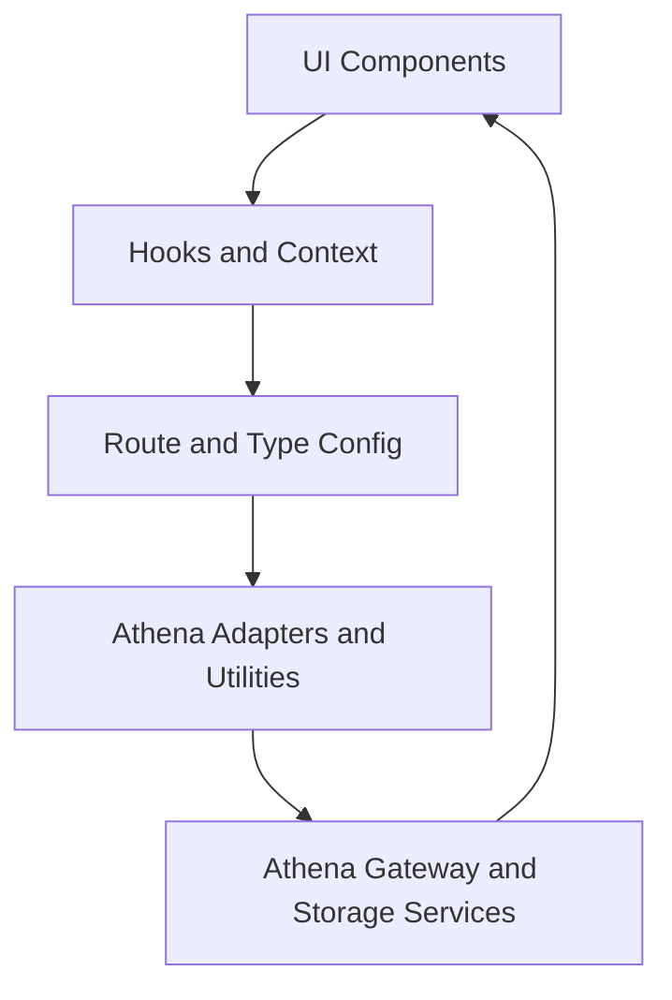

# Architecture

<!-- codex:architecture-diagram:start -->
## Architecture Diagram

<!-- codex:architecture-diagram:end -->

## Layered Design

The Resource Framework is built on a layered architecture that separates concerns:

```
┌─────────────────────────────────────────┐
│      UI Components Layer                 │
│  (ResourceTable, ResourceDrilldown)     │
└─────────────────────────────────────────┘
              ↓ uses
┌─────────────────────────────────────────┐
│      Hooks & Context Layer               │
│  (useResourceRoute, useApiClient)       │
└─────────────────────────────────────────┘
              ↓ uses
┌─────────────────────────────────────────┐
│      Types & Configuration Layer         │
│  (ResourceRoute, resource-types.ts)     │
└─────────────────────────────────────────┘
              ↓ uses
┌─────────────────────────────────────────┐
│      Utilities & Adapters Layer          │
│  (Templates, Data API, Helpers)         │
└─────────────────────────────────────────┘
```

## Core Concepts

### 1. Resources
A resource is a domain entity (customer, invoice, etc.) with a defined schema and UI representation.

### 2. Routes
Resource routes define how a resource should be displayed in tables and drilldowns, including columns, filters, and available actions.

### 3. Widgets
Reusable UI components that display data in different formats (tables, JSON, file explorers) within drilldown sections.

### 4. Templating
Dynamic value resolution using `{{prefix.key}}` syntax for configuration-driven UI.

### 5. Type Safety
Full TypeScript support ensures compile-time safety across configuration and components.

## Data Flow

```
User Action
    ↓
Hook (useResourceRoute)
    ↓
Registry Lookup (get ResourceRoute)
    ↓
Template Resolution ({{…}} tokens)
    ↓
API Request (useApiClient)
    ↓
Component Render
    ↓
UI Display
```

## Design Principles

- **Configuration over Code**: Resources defined declaratively
- **Composability**: Mix and match components, widgets, and hooks
- **Extensibility**: Strategy patterns for custom behavior
- **Type Safety**: TypeScript throughout
- **Performance**: Memoization, efficient lookups
- **Security**: Input validation, XSS prevention

<!-- codex:architecture-review:start -->
## Architecture Assessment
- Technical debt rating: 2/5 - the layering is sound, but the boundaries are still blurred by app-specific imports and mixed transport concerns.
- Refactor path: Split the architecture into clearer package seams: headless UI, data client, registries, and app bindings.
- Replacement: A multi-package workspace with a stable core package and optional integration packages.
- Weak points: Some components still reach into host aliases, data concerns leak into hooks, and the published surface is tighter than the internal dependency graph.
<!-- codex:architecture-review:end -->
