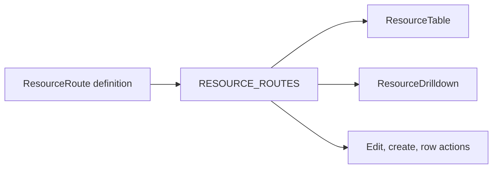

# Resource Routes

<!-- codex:architecture-diagram:start -->
## Architecture Diagram

<!-- codex:architecture-diagram:end -->

Resource routes define how resources appear and behave in the dashboard.

## Basic Definition

```typescript
import { defineResourceRoute } from '@/packages/resource-framework/constructors/define-drizzle-resource-route';

export const customersRoute: ResourceRoute = {
  table: 'customers',
  idColumn: 'customer_id',
  path: '/customers',
  searchBy: 'name',
  columns: [
    'customer_id',
    'name',
    { column_name: 'email', header: 'Email Address' },
    { column_name: 'status', editable: { type: 'select', options: [{ label: 'Active', value: 'active' }] } }
  ],
  edit: { enabled: true },
  create: { scope: 'admin', required: ['name', 'email'] },
};
```

## Key Properties

- `table`: Database table name (required)
- `idColumn`: Primary key column (required)
- `path`: URL path for this resource
- `columns`: Array of column definitions
- `searchBy`: Column to search on
- `edit`: Edit configuration
- `create`: Create configuration
- `rowActions`: Custom actions per row
- `customComponent`: Custom React component
- `drilldownRoutes`: Child drilldowns

## Column Configuration

```typescript
{
  column_name: 'created_at',
  header: 'Created Date',
  data_type: 'date',
  formatter: (value) => new Date(value).toLocaleDateString(),
  hidden: false,
  minWidth: 150,
  editable: {
    type: 'text',
    update_table: 'customers',
    update_column: 'created_at'
  }
}
```

## Edit Configuration

```typescript
edit: {
  enabled: true,
  allowedColumns: ['name', 'email', 'status'],
  scope: 'admin',
  IgnoreCompanyCheckBeforeMutation: false
}
```

## Create Configuration

```typescript
create: {
  scope: 'admin',
  required: ['name', 'email'],
  optional: ['phone'],
  columns: [
    { column_name: 'name', label: 'Customer Name' },
    { column_name: 'email' }
  ]
}
```

## Row Actions

```typescript
rowActions: [
  {
    label: 'View Details',
    onClick: (row) => navigate(`/customers/${row.customer_id}`)
  },
  {
    label: 'Delete',
    onClick: (row) => deleteCustomer(row.customer_id),
    destructive: true
  },
  { type: 'separator' }
]
```

## See Also

- [Drilldown Routes](./03-drilldown-routes.md)
- [Columns](./10-columns.md)
- [Templates](./31-templating-system.md)

<!-- codex:architecture-review:start -->
## Architecture Assessment
- Technical debt rating: 3/5 - route objects are powerful but can become monolithic configuration blobs.
- Refactor path: Normalize route authoring into smaller composable route fragments and validator-backed constructors.
- Replacement: A typed route DSL or generated route manifests from schema metadata.
- Weak points: Large route objects are hard to diff, easy to misconfigure, and can mix UI concerns with permissions and data behavior.
<!-- codex:architecture-review:end -->
