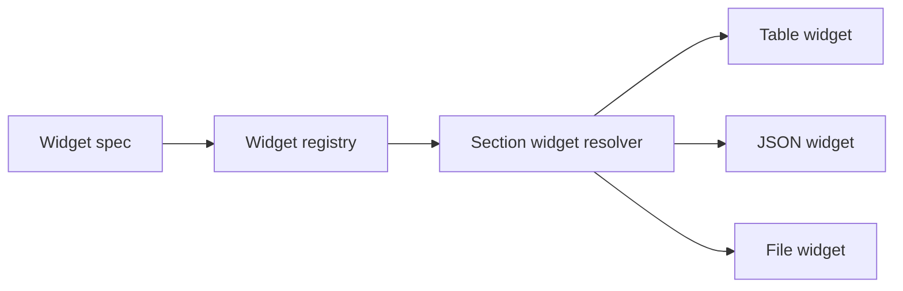

# Widgets

<!-- codex:architecture-diagram:start -->
## Architecture Diagram

<!-- codex:architecture-diagram:end -->

Widgets are reusable components for displaying data in drilldowns.

## Built-in Widgets

### Table Widget

Display related resource data in a filterable, paginated table.

```typescript
{
  type: 'table',
  props: {
    resourceName: 'invoices',
    title: 'Recent Invoices',
    titleSize: 'small',
    conditions: [
      { eq_column: 'customer_id', eq_value: '{{resource_id}}' }
    ],
    enableSearch: true,
    enableFilters: true,
    enablePagination: true,
    limit: 10,
    columns: ['invoice_id', 'amount', 'status', 'created_at']
  }
}
```

### JSON Widget

Display nested data structures.

```typescript
{
  type: 'json',
  props: {
    title: 'Raw Data',
    data: { /* object to display */ }
  }
}
```

### File Explorer Widget

Browse and manage files.

```typescript
{
  type: 'file_explorer',
  props: {
    title: 'Attachments',
    table: 'files',
    bucket: 'suitsconnect',
    conditions: [
      { eq_column: 'resource_id', eq_value: '{{resource_id}}' }
    ],
    objectPath: 'customers/{{resource_id}}/files',
    allowUpload: true,
    allowDelete: true,
    maxFileSizeMB: 50
  }
}
```

## Widget Props

### Common Props

- `title?: string` - Widget title
- `id?: string` - Unique identifier
- `props?: Record<string, unknown>` - Widget-specific configuration

## Custom Widgets

Implement `SectionWidgetRendererProps`:

```typescript
interface SectionWidgetRendererProps {
  spec: DrilldownSectionWidgetSpec;
  entity: Record<string, unknown>;
}

export function CustomWidget({ spec, entity }: SectionWidgetRendererProps) {
  const props = spec.props || {};
  
  return (
    <div>
      {/* Render custom content */}
    </div>
  );
}

registerSectionWidget('custom', CustomWidget);
```

## Registration

```typescript
import { registerSectionWidget } from '@/packages/resource-framework/components/sections/widgets/registry';

registerSectionWidget('my_widget', MyCustomWidget);
```

## Template Support

Widgets support `{{…}}` tokens in:
- Conditions
- Object paths
- Configuration values

## See Also

- [File Explorer Widget](./21-file-explorer-widget.md)
- [Templates](./31-templating-system.md)
- [Widget Registry](./12-widget-registry.md)

<!-- codex:architecture-review:start -->
## Architecture Assessment
- Technical debt rating: 3/5 - widgets are extensible, but the contract across widget types is still uneven.
- Refactor path: Standardize widget lifecycle, props validation, loading state, and error boundaries behind a common plugin contract.
- Replacement: A formally typed widget plugin interface with schema-based prop validation.
- Weak points: Inconsistent prop shapes, mixed rendering and data access responsibilities, and limited runtime validation for custom widgets.
<!-- codex:architecture-review:end -->
