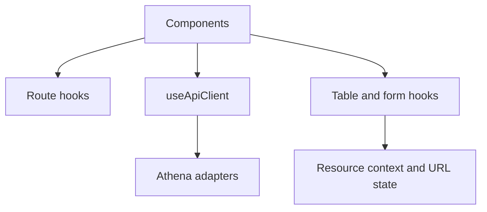

# Hooks

<!-- codex:architecture-diagram:start -->
## Architecture Diagram

<!-- codex:architecture-diagram:end -->

Reusable React hooks for resource-related operations.

## useResourceRoute

Get resource route configuration.

```typescript
import { useResourceRoute } from '@/packages/resource-framework/hooks/useResourceRoute';

function MyComponent() {
  const route = useResourceRoute('customers');
  
  return <div>{route?.table}</div>;
}
```

## useApiClient

Fetch and manage resource data.

```typescript
import { useApiClient } from '@/packages/resource-framework/hooks/use-api-client';

function MyTable() {
  const { data, isLoading, insert, remove } = useApiClient({
    table: 'customers',
    conditions: [
      { eq_column: 'status', eq_value: 'active' }
    ],
    columns: ['customer_id', 'name', 'email']
  });

  return isLoading ? 'Loading...' : <div>{data?.length} records</div>;
}
```

## useTableConfiguration

Configure table display and filtering.

```typescript
import { useTableConfiguration } from '@/packages/resource-framework/hooks/useTableConfiguration';

function MyTable() {
  const { columns, sorting, pagination } = useTableConfiguration('customers');
  
  return <Table columns={columns} sorting={sorting} />;
}
```

## useResourceContext

Access resource context from ResourceProvider.

```typescript
import { useResourceContext } from '@/packages/resource-framework/hooks/useResourceContext';

function MyComponent() {
  const { resource, resourceName, isLoading } = useResourceContext();
  
  return <div>{resourceName}: {resource?.name}</div>;
}
```

## useResourceColumns

Get parsed column definitions.

```typescript
import { useResourceColumns } from '@/packages/resource-framework/hooks/useResourceColumns';

function MyComponent() {
  const columns = useResourceColumns('customers');
  
  return columns.map(col => <Column key={col.column_name} {...col} />);
}
```

## useAdvancedFilters

Manage advanced filter state.

```typescript
import { useAdvancedFilters } from '@/packages/resource-framework/hooks/useAdvancedFilters';

function FilterPanel() {
  const { filters, addFilter, removeFilter } = useAdvancedFilters();
  
  return (
    <>
      {filters.map(f => (
        <FilterChip key={f.id} filter={f} onRemove={removeFilter} />
      ))}
    </>
  );
}
```

## useQueryFilters

Sync filters with URL query params.

```typescript
import { useQueryFilters } from '@/packages/resource-framework/hooks/useQueryFilters';

function FilterSync() {
  const { filters, setFilters } = useQueryFilters();
  
  return <FilterPanel filters={filters} onChange={setFilters} />;
}
```

## useUserScopes

Check user permissions.

```typescript
import { useUserScopes } from '@/packages/resource-framework/hooks/useUserScopes';

function AdminOnly() {
  const { hasScope } = useUserScopes();
  
  return hasScope('admin') ? <AdminPanel /> : <AccessDenied />;
}
```

## useUserPreferences

Store user UI preferences.

```typescript
import { useUserPreferences } from '@/packages/resource-framework/hooks/useUserPreferences';

function TableView() {
  const { preferences, setPreference } = useUserPreferences('table_view');
  
  return (
    <Table
      density={preferences.density}
      onDensityChange={(d) => setPreference('density', d)}
    />
  );
}
```

## See Also

- [Data API](./08-data-api.md)
- [ResourceProvider](./13-resource-provider.md)

<!-- codex:architecture-review:start -->
## Architecture Assessment
- Technical debt rating: 4/5 - the hook layer is broad and overlaps state, transport, and view composition.
- Refactor path: Split hooks into domain data hooks, UI state hooks, and integration hooks with a narrower surface.
- Replacement: A query-library-backed data layer plus thin headless UI hooks.
- Weak points: The hook set is difficult to document completely, internal assumptions can leak through signatures, and testing hooks in isolation is uneven.
<!-- codex:architecture-review:end -->
