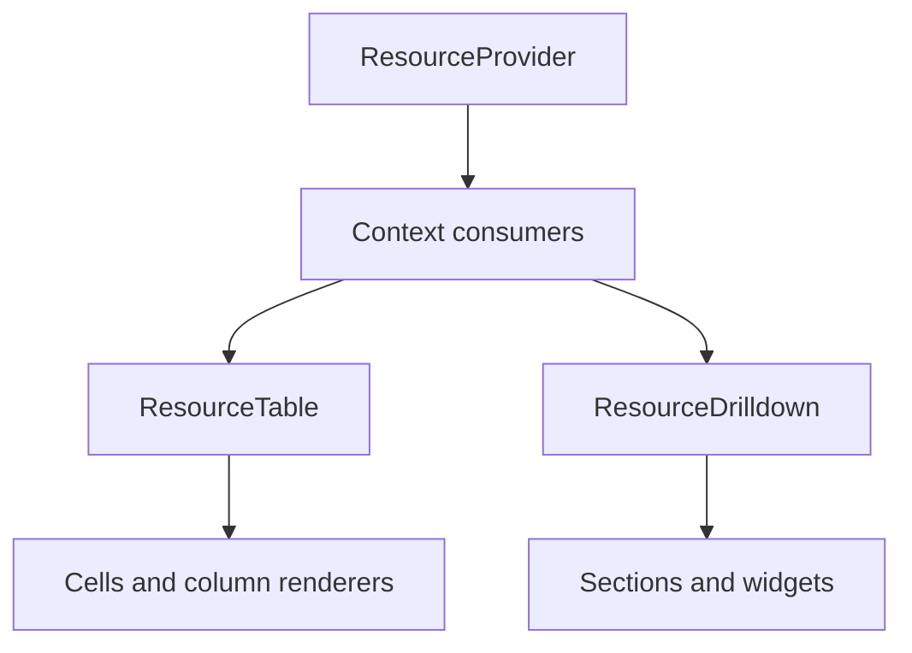

# Components

<!-- codex:architecture-diagram:start -->
## Architecture Diagram

<!-- codex:architecture-diagram:end -->

Reusable React components for resource-driven UIs.

## ResourceTable

Display a list of resources in a table.

```typescript
import { ResourceTable } from '@/packages/resource-framework/components/ResourceTable';

function CustomersPage() {
  return <ResourceTable resourceName="customers" />;
}
```

**Features:**
- Sorting
- Filtering
- Pagination
- Search
- CSV export
- Inline editing
- Row actions
- Column visibility

## ResourceDrilldown

Display detailed view of a single resource.

```typescript
import { ResourceDrilldown } from '@/packages/resource-framework/components/ResourceDrilldown';

function CustomerDetailPage({ customerId }) {
  return (
    <ResourceDrilldown
      resourceName="customers"
      resourceId={customerId}
    />
  );
}
```

**Features:**
- Multi-section layout
- Widget support
- Edit state management
- Related resources
- File management

## ResourceProvider

Context provider for resource data.

```typescript
import { ResourceProvider } from '@/packages/resource-framework/components/ResourceProvider';

function Layout() {
  return (
    <ResourceProvider resourceName="customers" resourceId="123">
      <ResourceDrilldown />
    </ResourceProvider>
  );
}
```

## DrilldownSection

Display a section within a drilldown.

```typescript
import { DrilldownSection } from '@/packages/resource-framework/components/drilldown/drilldown-section';

function MySection() {
  return (
    <DrilldownSection
      title="Details"
      fields={['name', 'email', 'status']}
    />
  );
}
```

## DrilldownFileExplorer

File management in drilldowns.

```typescript
import { DrilldownFileExplorer } from '@/packages/resource-framework/components/drilldown/drilldown-file-explorer';

function FileSection() {
  return (
    <DrilldownFileExplorer
      title="Attachments"
      files={files}
      onUpload={handleUpload}
      onDelete={handleDelete}
      allowUpload={true}
    />
  );
}
```

## ResourceDrilldownSection

Composite section component.

```typescript
import { ResourceDrilldownSection } from '@/packages/resource-framework/components/resource-drilldown-section';

function MyDrilldown() {
  return (
    <ResourceDrilldownSection
      title="Details"
      config={sectionConfig}
      entity={data}
    />
  );
}
```

## CreateResourceButton

Button to create new resources.

```typescript
import { CreateResourceButton } from '@/packages/resource-framework/components/create-resource-button';

function Page() {
  return (
    <>
      <h1>Customers</h1>
      <CreateResourceButton resourceName="customers" />
    </>
  );
}
```

## See Also

- [Drilldown Routes](./03-drilldown-routes.md)
- [Widgets](./04-widgets.md)

<!-- codex:architecture-review:start -->
## Architecture Assessment
- Technical debt rating: 3/5 - the components are reusable, but several still assume framework-wide context and styling conventions.
- Refactor path: Push more behavior into headless primitives and let host apps own more presentation-specific wrappers.
- Replacement: A headless component package with optional themed wrappers.
- Weak points: Component composition is strong, but portability is limited when host aliases or shared design primitives are assumed.
<!-- codex:architecture-review:end -->
