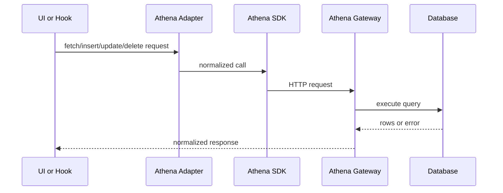

# Athena Data API

<!-- codex:architecture-diagram:start -->
## Architecture Diagram

<!-- codex:architecture-diagram:end -->

The framework now uses Athena as its primary data plane. Package code should call the Athena-backed adapters or `useApiClient`.

## Core Adapters

### Fetch Data

```typescript
import { fetchDataViaAthena } from "@/packages/resource-framework/adapters";

const result = await fetchDataViaAthena({
  table_name: "customers",
  conditions: [
    { eq_column: "status", eq_value: "active" },
  ],
  columns: ["customer_id", "name", "email"],
  limit: 50,
});
```

You can pass transport metadata through the optional config argument:

```typescript
await fetchDataViaAthena(
  { table_name: "customers" },
  {
    requestId: "req-123",
    headers: { "X-Organization-Id": "org-123" },
  },
);
```

### Insert Data

```typescript
import { insertDataViaAthena } from "@/packages/resource-framework/adapters";

const result = await insertDataViaAthena({
  table_name: "customers",
  insert_body: {
    name: "Acme Corp",
    email: "contact@acme.com",
    status: "active",
  },
});
```

Mutations accept `idempotencyKey` in the optional config argument and propagate it as both `Idempotency-Key` and `X-Idempotency-Key`.

### Update Data

```typescript
import { updateDataViaAthena } from "@/packages/resource-framework/adapters";

const result = await updateDataViaAthena({
  table_name: "customers",
  x_column: "customer_id",
  x_id: "cust-123",
  update_body: {
    status: "inactive",
  },
});
```

### Delete Data

```typescript
import { deleteDataViaAthena } from "@/packages/resource-framework/adapters";

const result = await deleteDataViaAthena({
  table_name: "customers",
  x_column: "customer_id",
  x_id: "cust-123",
});
```

## `useApiClient`

Recommended for most package consumers:

```typescript
const { data, isLoading, insert, update, remove } = useApiClient({
  table: "customers",
  conditions: [{ eq_column: "status", eq_value: "active" }],
  columns: ["customer_id", "name", "email"],
});

await insert({ name: "New Co", email: "new@co.com" });
await update("customer_id", "cust-123", { status: "inactive" });
await remove("customer_id", "cust-123");
```

`useApiClient` injects the current user, company, and organization headers into the Athena transport automatically.

## File Endpoints

The package also exposes Athena-backed file helpers:

```typescript
import {
  refreshFileUrlViaAthena,
  uploadFileViaAthena,
} from "@/packages/resource-framework/adapters";

const formData = new FormData();
formData.append("file", file);

const upload = await uploadFileViaAthena(formData);

const refreshed = await refreshFileUrlViaAthena({
  fileKey: "rsf/org-123/customers/cust-456/invoice.pdf",
  bucket: "suitsconnect",
});
```

## Request Shape

The framework-facing adapter contract remains:

```typescript
{
  table_name: string,
  conditions?: [
    { eq_column: string, eq_value: string | number | boolean | null }
  ],
  columns?: string[],
  x_column?: string,
  x_id?: string | number,
  update_body?: Record<string, unknown>,
  insert_body?: Record<string, unknown> | Record<string, unknown>[],
  limit?: number,
  offset?: number
}
```

The adapter maps this contract onto the Athena SDK/query builder.

## Error Handling

```typescript
try {
  const result = await fetchDataViaAthena({ table_name: "customers" });
  if (result.error) {
    console.error("Athena error:", result.error);
  }
} catch (error) {
  console.error("Transport error:", error);
}
```

## See Also

- [Hooks](./05-hooks.md)
- [HTTP Adapters](./08-http-adapters.md)

<!-- codex:architecture-review:start -->
## Architecture Assessment
- Technical debt rating: 4/5 - the data plane is improved, but the framework still normalizes multiple historical call shapes.
- Refactor path: Collapse the CRUD surface around explicit repository operations instead of generic table-centric commands.
- Replacement: Typed domain repositories or generated clients per resource family.
- Weak points: Generic table operations can hide missing constraints, response normalization adds compatibility overhead, and backend errors are still fairly raw.
<!-- codex:architecture-review:end -->
