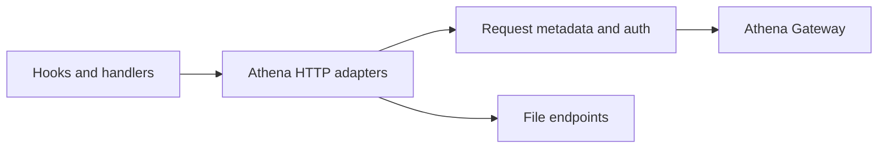

# HTTP Adapters

<!-- codex:architecture-diagram:start -->
## Architecture Diagram

<!-- codex:architecture-diagram:end -->

HTTP transport is centralized behind Athena-backed adapters.

## Primary Adapters

- `fetchDataViaAthena`
- `insertDataViaAthena`
- `updateDataViaAthena`
- `deleteDataViaAthena`
- `uploadFileViaAthena`
- `refreshFileUrlViaAthena`

These adapters isolate the rest of the framework from the underlying SDK and endpoint details.

## Headers

Athena requests are sent with:

```typescript
{
  "X-User-Id": user.user_id,
  "X-Company-Id": user.company_id,
  "X-Organization-Id": user.organization_id,
  "X-Athena-Client": APP_CONFIG.athena.standard_client,
}
```

The API key is supplied through Athena config (`APP_CONFIG.athena.api_key` or environment fallback) inside the adapter layer, not from ad hoc browser call sites.
Each adapter call also emits `X-Request-Id`; write and file-mutation paths emit `Idempotency-Key` and `X-Idempotency-Key`.

## Data Endpoints

The SDK-backed CRUD helpers map to Athena gateway routes:

- `POST /gateway/fetch`
- `PUT /gateway/insert`
- `POST /gateway/update`
- `DELETE /gateway/delete`

## File Endpoints

The file helpers target Athena-hosted file routes:

- `POST /api/upload`
- `POST /api/files/refresh-url`

The base URL defaults to `APP_CONFIG.athena.db_api_url` and can be overridden in adapter config for testing.

## Transformation

Response shaping happens in the adapter layer:

- single-row mutation results are normalized back to a single object
- array fetches stay arrays
- file upload responses are reduced to the returned `data` payload
- refresh-url helpers throw on invalid or missing signed URLs

## Custom Use

```typescript
import {
  fetchDataViaAthena,
  uploadFileViaAthena,
} from "@/packages/resource-framework/adapters";

const rows = await fetchDataViaAthena({
  table_name: "customers",
  limit: 25,
});

const formData = new FormData();
formData.append("file", file);

const uploaded = await uploadFileViaAthena(formData);
```

## See Also

- [Athena Data API](./07-data-api.md)
- [Testing](./25-testing.md)

<!-- codex:architecture-review:start -->
## Architecture Assessment
- Technical debt rating: 4/5 - this is a compatibility layer with real value, but it is still an integration boundary rather than the final architecture.
- Refactor path: Reduce duplicate request assembly and move toward one transport client with typed endpoint wrappers.
- Replacement: A single Athena client service with generated request/response types and interceptor hooks.
- Weak points: Header composition is duplicated conceptually across call sites, file and CRUD flows are related but still modeled separately, and failures are only partially classified.
<!-- codex:architecture-review:end -->
