# Columns

<!-- codex:architecture-diagram:start -->
## Architecture Diagram

```mermaid
flowchart TD
  ColumnSpec["Column specs"] --> Builder["Column builder"]
  Builder --> Registry["Column registry"]
  Registry --> Table["Rendered table columns"]
  ColumnSpec --> Editors["Editable controls"]
```

<!-- codex:architecture-diagram:end -->

Column definitions control how data is displayed and edited.

## Simple Columns

```typescript
columns: [
  'customer_id',    // Renders as-is
  'name',
  'email'
]
```

## Complex Columns

```typescript
columns: [
  {
    column_name: 'created_at',
    header: 'Date Created',
    header_label: 'When it was created',
    data_type: 'date',
    formatter: (value) => new Date(value).toLocaleDateString(),
    minWidth: 150,
    hidden: false,
    order: 1
  }
]
```

## Column Configuration

- `column_name`: Database column (required)
- `header`: Column header text
- `header_label`: Tooltip text
- `data_type`: 'string' | 'number' | 'boolean' | 'date' | 'json' | 'timestamp' | 'uuid' | 'other'
- `formatter`: Function to format display
- `minWidth`: Minimum column width
- `maxWidth`: Maximum column width
- `widthFit`: Auto-fit to content
- `hidden`: Hide from view
- `order`: Sort order
- `use`: Component to use for rendering

## Editable Columns

```typescript
{
  column_name: 'status',
  editable: {
    type: 'select',    // 'text', 'textarea', 'select', 'boolean'
    update_table: 'customers',
    update_id_column: 'customer_id',
    update_column: 'status',
    options: [
      { label: 'Active', value: 'active' },
      { label: 'Inactive', value: 'inactive' }
    ]
  }
}
```

## Data Sources

Fetch options from a related table:

```typescript
{
  column_name: 'country',
  editable: {
    type: 'select',
    data_source: {
      table: 'countries',
      column: 'country_name'
    }
  }
}
```

## Formatters

Custom display logic:

```typescript
{
  column_name: 'amount',
  formatter: (value, row) => {
    return `$${value.toFixed(2)}`;
  }
}
```

## defineColumns Helper

```typescript
import { defineColumns } from '@/packages/resource-framework/constructors/define-columns';

const columns = defineColumns([
  { column_name: 'id' },
  { column_name: 'name', header: 'Customer Name' },
  { column_name: 'email', hidden: false }
]);
```

## Column Registry

Get pre-defined columns:

```typescript
import { getColumnRegistry } from '@/packages/resource-framework/registries/column-registry';

const registry = getColumnRegistry('customers');
const columns = registry.getColumns();
```

## See Also

- [Resource Routes](./02-resource-routes.md)
- [Drilldown Routes](./03-drilldown-routes.md)

<!-- codex:architecture-review:start -->
## Architecture Assessment
- Technical debt rating: 3/5 - column metadata is capable, but formatting, editing, and layout metadata are all packed into one structure.
- Refactor path: Separate display metadata, editor metadata, and data semantics into distinct layers.
- Replacement: A typed column DSL with schema-driven editor factories.
- Weak points: Large column specs are easy to overconfigure, editor options can become repetitive, and column metadata has many optional branches.
<!-- codex:architecture-review:end -->
