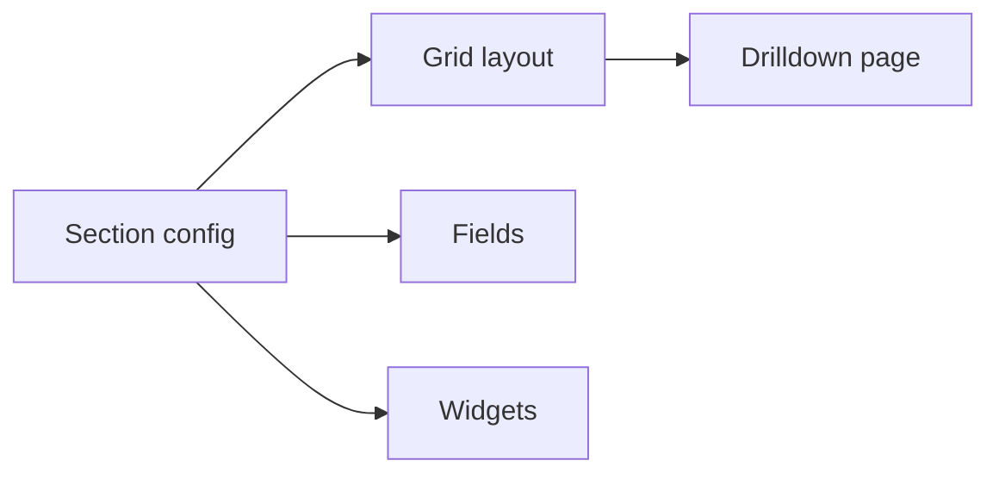

# Sections

<!-- codex:architecture-diagram:start -->
## Architecture Diagram

<!-- codex:architecture-diagram:end -->

Sections are logical groupings within drilldown views.

## Basic Structure

```typescript
{
  title: 'General Information',
  columns: 2,
  fields: ['name', 'email', 'phone'],
  expose_to_edit_state: true
}
```

## Properties

- `title`: Section header (required)
- `columns`: Grid layout (1, 2, 3, or 4)
- `fields`: Field definitions
- `widgets`: Widget instances
- `expose_to_edit_state`: Include in edit mode
- `autoHideEmptyColumns`: Hide empty columns

## Field Types

### Simple Fields

```typescript
fields: ['name', 'email', 'status']
```

### Complex Fields

```typescript
fields: [
  {
    key: 'customer_id',
    label: 'Customer ID',
    hidden: false,
    field_type: 'text'
  }
]
```

## Widgets in Sections

```typescript
{
  title: 'Related Data',
  columns: 1,
  fields: [],
  widgets: [
    {
      type: 'table',
      props: { resourceName: 'invoices' }
    },
    {
      type: 'json',
      props: { title: 'Metadata' }
    }
  ]
}
```

## Multi-column Layout

```typescript
{
  title: 'Details',
  columns: 3,  // Display in 3-column grid
  fields: ['field1', 'field2', 'field3', 'field4', 'field5']
}
```

## Hidden Sections

```typescript
{
  title: 'Advanced',
  columns: 2,
  fields: ['internal_id', 'debug_info'],
  expose_to_edit_state: false  // Not in edit form
}
```

## Conditional Display

Use templates for conditional widgets:

```typescript
{
  title: 'Admin Info',
  columns: 1,
  fields: [],
  widgets: [
    {
      type: 'json',
      props: {
        data: '{{user.is_admin}}'  // Only if admin
      }
    }
  ]
}
```

## Nested Fields

```typescript
{
  title: 'Organization',
  columns: 2,
  fields: [
    'organization.name',
    'organization.type',
    'organization.country'
  ]
}
```

## Empty State Handling

```typescript
{
  title: 'Metadata',
  columns: 1,
  autoHideEmptyColumns: true,  // Hide if all fields empty
  fields: ['meta1', 'meta2', 'meta3']
}
```

## See Also

- [Drilldown Routes](./03-drilldown-routes.md)
- [Fields](./10-fields.md)
- [Widgets](./04-widgets.md)

<!-- codex:architecture-review:start -->
## Architecture Assessment
- Technical debt rating: 3/5 - sections are a good abstraction, but they still blend data grouping, layout, and editing exposure.
- Refactor path: Model sections as a smaller layout primitive plus explicit content descriptors.
- Replacement: A declarative layout schema with separate section semantics and render policies.
- Weak points: Section shape is broad, widget-heavy sections can be opaque, and edit-state exposure is a cross-cutting concern hidden inside layout config.
<!-- codex:architecture-review:end -->
