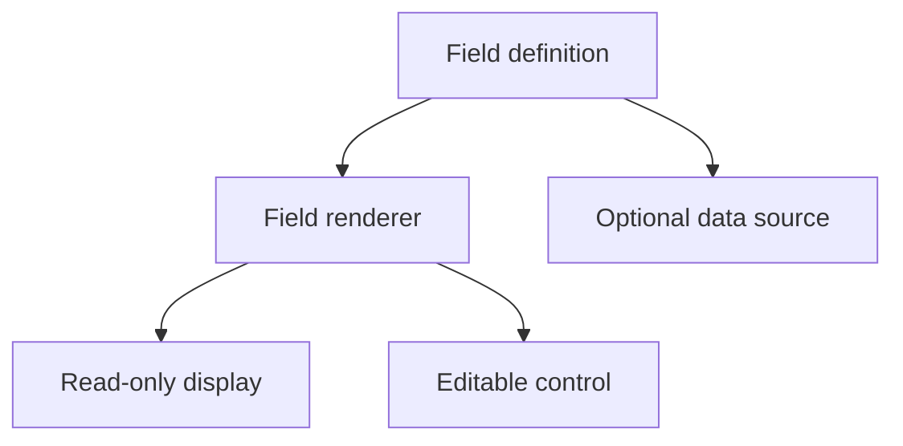

# Fields

<!-- codex:architecture-diagram:start -->
## Architecture Diagram

<!-- codex:architecture-diagram:end -->

Fields display individual pieces of data.

## Basic Fields

```typescript
{
  key: 'email',
  label: 'Email Address'
}
```

## Field Properties

- `key`: Field identifier (required)
- `label`: Display label
- `hidden`: Hide field
- `field_type`: 'text', 'number', 'boolean', 'select', 'date'
- `options`: Select options
- `data_source`: Data source for options

## Field Types

### Text

```typescript
{
  key: 'name',
  label: 'Customer Name',
  field_type: 'text'
}
```

### Number

```typescript
{
  key: 'amount',
  label: 'Amount',
  field_type: 'number'
}
```

### Boolean

```typescript
{
  key: 'is_active',
  label: 'Active',
  field_type: 'boolean'
}
```

### Select

```typescript
{
  key: 'status',
  label: 'Status',
  field_type: 'select',
  options: [
    { value: 'active', label: 'Active' },
    { value: 'inactive', label: 'Inactive' }
  ]
}
```

### Date

```typescript
{
  key: 'created_at',
  label: 'Created Date',
  field_type: 'date'
}
```

## Dynamic Options

```typescript
{
  key: 'country',
  label: 'Country',
  field_type: 'select',
  data_source: {
    table: 'countries',
    column: 'country_name'
  }
}
```

## Hidden Fields

```typescript
{
  key: 'internal_id',
  hidden: true
}
```

## Read-only Fields

```typescript
{
  key: 'created_at',
  label: 'Created',
  field_type: 'text',
  // (no editable config = read-only)
}
```

## Custom Formatting

```typescript
{
  key: 'updated_at',
  label: 'Last Updated',
  formatter: (value) => {
    return new Date(value).toLocaleString();
  }
}
```

## Validation

Validate using data_type:

```typescript
{
  key: 'email',
  label: 'Email',
  data_type: 'email'  // or: 'phone', 'url', 'uuid'
}
```

## See Also

- [Columns](./09-columns.md)
- [Sections](./10-sections.md)
- [Templating](./30-templating.md)

<!-- codex:architecture-review:start -->
## Architecture Assessment
- Technical debt rating: 3/5 - field definitions are flexible, but the distinction between display fields and interactive fields is not always sharp.
- Refactor path: Split field display descriptors from input/editor descriptors and centralize control selection.
- Replacement: A field registry keyed by semantic type with strict prop contracts.
- Weak points: Optional properties make field behavior hard to infer quickly, and data source behavior is only loosely documented.
<!-- codex:architecture-review:end -->
