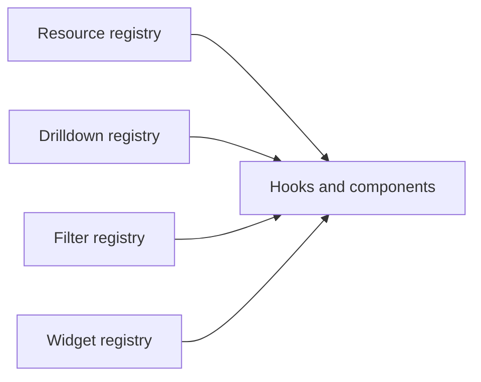

# Registries

<!-- codex:architecture-diagram:start -->
## Architecture Diagram

<!-- codex:architecture-diagram:end -->

Registries are centralized configuration stores.

## Resource Routes Registry

```typescript
import { RESOURCE_ROUTES } from '@/packages/resource-framework/registries/resource-routes';

const customersRoute = RESOURCE_ROUTES.customers;
const invoicesRoute = RESOURCE_ROUTES.invoices;
```

## Drilldown Routes Registry

```typescript
import { RESOURCE_DRILLDOWN_ROUTES } from '@/packages/resource-framework/registries/resource-drilldown-routes';

const customerDrilldown = RESOURCE_DRILLDOWN_ROUTES.customers;
```

## Filter Registry

```typescript
import { FILTER_REGISTRY } from '@/packages/resource-framework/registries/filter-registry';

// Get filters for string type
const stringFilters = FILTER_REGISTRY['string'];

// Available operators: eq, neq, gt, gte, lt, lte, contains, starts_with, ends_with, in, not_in, is_null, is_not_null
```

## Widget Registry

```typescript
import { registerSectionWidget, getSectionWidget } from '@/packages/resource-framework/components/sections/widgets/registry';

// Register custom widget
registerSectionWidget('my_widget', MyWidget);

// Get widget
const widget = getSectionWidget('my_widget');
```

## Column Registry

```typescript
import { defineColumns } from '@/packages/resource-framework/constructors/define-columns';

const customerColumns = defineColumns([
  { column_name: 'id' },
  { column_name: 'name', header: 'Customer Name' }
]);
```

## Accessing Registries

```typescript
import { useResourceRoute } from '@/packages/resource-framework/hooks/useResourceRoute';

function MyComponent() {
  const route = useResourceRoute('customers');
  
  if (!route) {
    return <div>Resource not found</div>;
  }
  
  return <div>{route.table}</div>;
}
```

## Registry Lookups

```typescript
// Find by resource name
const route = RESOURCE_ROUTES['customers'];

// Check if exists
if (RESOURCE_ROUTES['customers']) {
  // Resource configured
}

// List all
const allRoutes = Object.keys(RESOURCE_ROUTES);
```

## Dynamic Registration

```typescript
// Register new route at runtime
RESOURCE_ROUTES['custom_resource'] = {
  table: 'custom_table',
  idColumn: 'id',
  columns: ['id', 'name']
};
```

## Type Safety

All registries are strongly typed:

```typescript
const route: ResourceRoute = RESOURCE_ROUTES.customers;
const drilldown: ResourceDrilldownRoute = RESOURCE_DRILLDOWN_ROUTES.customers;
```

## See Also

- [Resource Routes](./02-resource-routes.md)
- [Drilldown Routes](./03-drilldown-routes.md)
- [Filters](./15-filters.md)

<!-- codex:architecture-review:start -->
## Architecture Assessment
- Technical debt rating: 4/5 - centralized registries simplify discovery but increase global coupling.
- Refactor path: Adopt module-scoped registration or lazy registry composition by feature area.
- Replacement: Plugin modules that export route bundles and register themselves explicitly.
- Weak points: Global registries are hard to split by domain, difficult to tree-shake, and prone to merge conflicts in larger teams.
<!-- codex:architecture-review:end -->
