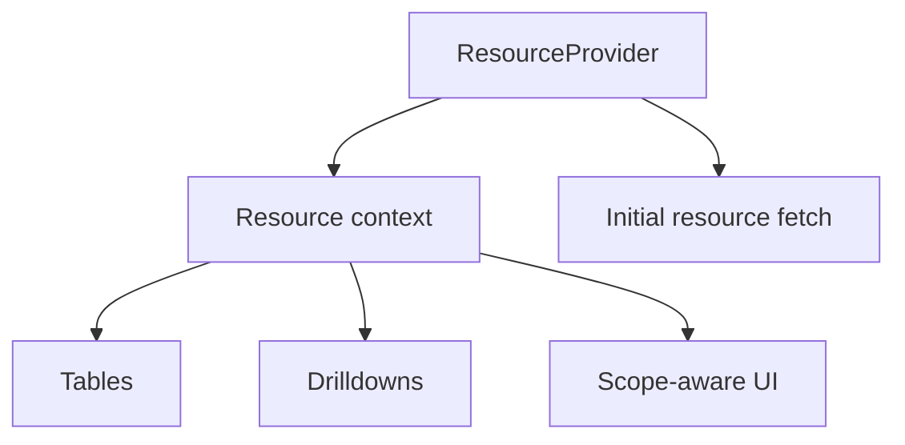

# ResourceProvider

<!-- codex:architecture-diagram:start -->
## Architecture Diagram

<!-- codex:architecture-diagram:end -->

ResourceProvider is a React context wrapper for resource state.

## Basic Usage

```typescript
import { ResourceProvider } from '@/packages/resource-framework/components/ResourceProvider';

function CustomerPage({ customerId }) {
  return (
    <ResourceProvider
      resourceName="customers"
      resourceId={customerId}
    >
      <CustomerDetail />
    </ResourceProvider>
  );
}
```

## Props

- `resourceName`: Resource name (required)
- `resourceId`: Resource ID (required)
- `children`: Child components

## Accessing Context

```typescript
import { useResourceContext } from '@/packages/resource-framework/hooks/useResourceContext';

function CustomerDetail() {
  const {
    resource,           // Resource data
    resourceName,       // Resource type
    resourceId,         // Resource ID
    isLoading,          // Loading state
    error,              // Error message
    refetch             // Refresh data function
  } = useResourceContext();

  if (isLoading) return <div>Loading...</div>;
  if (error) return <div>Error: {error}</div>;
  
  return <div>{resource.name}</div>;
}
```

## Edit Mode

```typescript
function CustomerDetail() {
  const { resource, setEditMode, editMode } = useResourceContext();

  if (editMode) {
    return <CustomerForm customer={resource} />;
  }

  return (
    <>
      <CustomerDisplay customer={resource} />
      <button onClick={() => setEditMode(true)}>Edit</button>
    </>
  );
}
```

## Updating Data

```typescript
function CustomerForm() {
  const { resource, updateResource } = useResourceContext();

  const handleSubmit = async (data) => {
    await updateResource(data);
  };

  return <form onSubmit={handleSubmit}>...</form>;
}
```

## Related Resources

```typescript
function CustomerDetail() {
  const { relationships } = useResourceContext();
  
  // Access related invoices
  const invoices = relationships.invoices;

  return (
    <div>
      <Invoices items={invoices} />
    </div>
  );
}
```

## Nested Providers

```typescript
function App() {
  return (
    <ResourceProvider resourceName="customers" resourceId="1">
      <div>
        <ResourceProvider resourceName="invoices" resourceId="100">
          <InvoiceDetail />
        </ResourceProvider>
      </div>
    </ResourceProvider>
  );
}
```

## Error Handling

```typescript
function CustomerDetail() {
  const { error, retry } = useResourceContext();

  if (error) {
    return (
      <div>
        <p>Error: {error}</p>
        <button onClick={retry}>Retry</button>
      </div>
    );
  }

  return <div>Content</div>;
}
```

## Cache Control

```typescript
<ResourceProvider
  resourceName="customers"
  resourceId="1"
  cache={false}  // Disable caching
>
  <Content />
</ResourceProvider>
```

## See Also

- [Hooks](./05-hooks.md)
- [Components](./06-components.md)

<!-- codex:architecture-review:start -->
## Architecture Assessment
- Technical debt rating: 4/5 - the provider centralizes useful state, but it risks becoming a broad ambient dependency.
- Refactor path: Split provider responsibilities into resource data, permissions, and user preferences contexts.
- Replacement: Smaller providers combined by page-level composition or a query cache plus selectors.
- Weak points: Context churn can affect render performance, consumer expectations can sprawl, and test setup becomes heavier as more state is included.
<!-- codex:architecture-review:end -->
