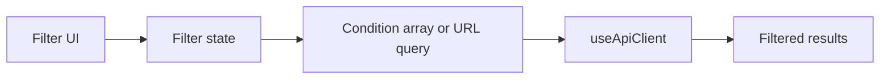

# Filters

<!-- codex:architecture-diagram:start -->
## Architecture Diagram

<!-- codex:architecture-diagram:end -->

Filtering data in tables and drilldowns.

## Basic Filtering

```typescript
const { data } = useApiClient({
  table: 'customers',
  conditions: [
    { eq_column: 'status', eq_value: 'active' },
    { eq_column: 'country', eq_value: 'US' }
  ]
});
```

## Advanced Filters

```typescript
import { useAdvancedFilters } from '@/packages/resource-framework/hooks/useAdvancedFilters';

function FilterPanel() {
  const {
    filters,
    addFilter,
    removeFilter,
    updateFilter,
    clearFilters
  } = useAdvancedFilters();

  return (
    <>
      {filters.map(f => (
        <FilterChip
          key={f.id}
          filter={f}
          onUpdate={(updated) => updateFilter(f.id, updated)}
          onRemove={() => removeFilter(f.id)}
        />
      ))}
      <button onClick={addFilter}>Add Filter</button>
      <button onClick={clearFilters}>Clear All</button>
    </>
  );
}
```

## Filter Operators

- `eq` - equals
- `neq` - not equals
- `gt` - greater than
- `gte` - greater than or equal
- `lt` - less than
- `lte` - less than or equal
- `contains` - contains text
- `starts_with` - starts with
- `ends_with` - ends with
- `in` - in list
- `not_in` - not in list
- `is_null` - is null
- `is_not_null` - is not null

## Filter Definition

```typescript
{
  id: 'filter-1',
  column: 'status',
  operator: 'eq',
  value: 'active',
  dataType: 'string'
}
```

## Filter Registry

```typescript
import { FILTER_REGISTRY } from '@/packages/resource-framework/registries/filter-registry';

// Get operators for string type
const stringOps = FILTER_REGISTRY['string'].operators;
// ['eq', 'neq', 'contains', 'starts_with', 'ends_with', 'in', 'not_in']

// Get operators for number type
const numberOps = FILTER_REGISTRY['number'].operators;
// ['eq', 'neq', 'gt', 'gte', 'lt', 'lte', 'in', 'not_in']
```

## URL Sync

Filters sync with URL query params:

```typescript
import { useSearchParams } from 'next/navigation';
import { parseQueryFilters } from '@xylex-group/resource-framework';

function Page() {
  const searchParams = useSearchParams();
  const filters = parseQueryFilters(searchParams);

  // URL: ?filters=status:active,country:US
  return <FilterPanel filters={filters} />;
}
```

## Saved Filters

```typescript
const { saveFilter, savedFilters, applyFilter } = useFilterPresets();

// Save current filters
saveFilter('My Filters', currentFilters);

// List saved
savedFilters.forEach(f => <button onClick={() => applyFilter(f)}>{f.name}</button>);
```

## Client-side Filtering

```typescript
import { applyClientFilters } from '@/packages/resource-framework/utils/client-filter';

const filtered = applyClientFilters(data, filters);
```

## See Also

- [Data API](./07-data-api.md)
- [Hooks](./05-hooks.md)

<!-- codex:architecture-review:start -->
## Architecture Assessment
- Technical debt rating: 3/5 - filtering works, but condition formats and UI-level filter state still have multiple representations.
- Refactor path: Adopt a single filter AST used by UI, URL serialization, and backend requests.
- Replacement: A canonical filter schema with parser/serializer utilities generated from operator metadata.
- Weak points: Cross-page filter persistence is hard, nested conditions are not first-class, and debugging filter payloads can be noisy.
<!-- codex:architecture-review:end -->
