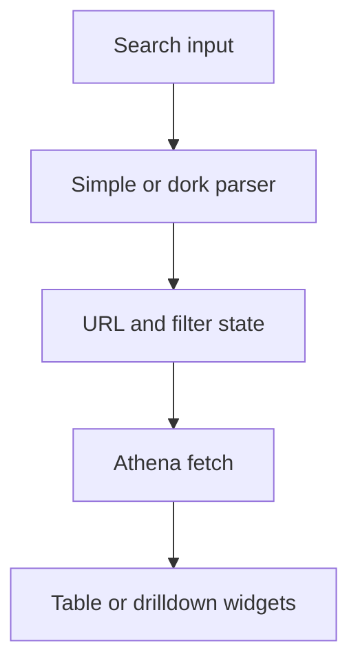

# Search

<!-- codex:architecture-diagram:start -->
## Architecture Diagram

<!-- codex:architecture-diagram:end -->

Search and query functionality for resources.

## Basic Search

```typescript
const { data } = useApiClient({
  table: 'customers',
  search: 'John',
  searchBy: 'name'  // Defined in resource route
});
```

## Dork Query Parser

Parse complex search queries:

```typescript
import { parseDorkQuery } from '@/packages/resource-framework/utils/dork-query';

const query = 'status:active country:"United States" -archived';
const parsed = parseDorkQuery(query);
// { status: 'active', country: 'United States', _not: ['archived'] }
```

## Search Operators

- `:` - exact match: `status:active`
- `""` - phrase: `"John Doe"`
- `-` - exclude: `-archived`
- `>`, `<`, `>=`, `<=` - comparisons: `amount:>1000`

## Fuzzy Search

```typescript
import { fuzzyMatch } from '@/packages/resource-framework/utils/string';

const matches = data.filter(item =>
  fuzzyMatch(item.name, searchTerm)
);
```

## Search History

```typescript
import { useSearchHistory } from '@/packages/resource-framework/hooks/useSearchHistory';

function SearchBox() {
  const { history, addToHistory, clearHistory } = useSearchHistory('customers');

  return (
    <>
      <input
        onChange={(e) => {
          const term = e.target.value;
          if (term) addToHistory(term);
        }}
      />
      <div>
        {history.map(term => (
          <button key={term} onClick={() => search(term)}>{term}</button>
        ))}
        <button onClick={clearHistory}>Clear</button>
      </div>
    </>
  );
}
```

## Search Debouncing

```typescript
import { useDebounce } from '@/packages/resource-framework/hooks/use-debounce';

function SearchComponent() {
  const [query, setQuery] = useState('');
  const debouncedQuery = useDebounce(query, 300);

  useEffect(() => {
    if (debouncedQuery) {
      performSearch(debouncedQuery);
    }
  }, [debouncedQuery]);

  return <input onChange={(e) => setQuery(e.target.value)} />;
}
```

## Search Highlighting

```typescript
import { highlightMatches } from '@/packages/resource-framework/utils/string';

function SearchResult({ text, query }) {
  const highlighted = highlightMatches(text, query);
  return <div dangerouslySetInnerHTML={{ __html: highlighted }} />;
}
```

## Global Search

```typescript
function GlobalSearch() {
  const [query, setQuery] = useState('');
  const [results, setResults] = useState([]);

  useEffect(() => {
    if (query.length < 2) return;

    // Search across multiple resources
    Promise.all([
      searchCustomers(query),
      searchInvoices(query),
      searchOrders(query)
    ]).then(([customers, invoices, orders]) => {
      setResults([...customers, ...invoices, ...orders]);
    });
  }, [query]);

  return (
    <>
      <input onChange={(e) => setQuery(e.target.value)} />
      <SearchResults results={results} />
    </>
  );
}
```

## See Also

- [Filters](./15-filters.md)
- [Data API](./07-data-api.md)

<!-- codex:architecture-review:start -->
## Architecture Assessment
- Technical debt rating: 3/5 - search is usable, but plain text search and structured dork-style search are still loosely coupled.
- Refactor path: Unify search parsing into one query model with explicit tokenization and backend capabilities.
- Replacement: A search service abstraction that supports both free text and structured query compilation.
- Weak points: Search quality depends heavily on route config, dork syntax can be opaque to users, and backend support may differ across resources.
<!-- codex:architecture-review:end -->
