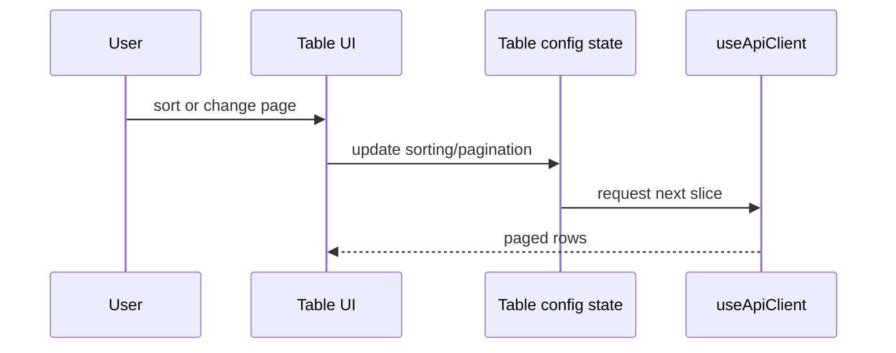

# Sorting and Pagination

<!-- codex:architecture-diagram:start -->
## Architecture Diagram

<!-- codex:architecture-diagram:end -->

Sorting and paginating large datasets.

## Sorting

```typescript
import { useTableConfiguration } from '@/packages/resource-framework/hooks/useTableConfiguration';

function TableComponent() {
  const {
    sorting,          // [{ id: 'name', desc: false }]
    setSorting
  } = useTableConfiguration('customers');

  const handleSort = (column) => {
    setSorting([{ id: column, desc: false }]);
  };

  return (
    <table>
      <thead>
        <tr>
          <th onClick={() => handleSort('name')}>Name</th>
          <th onClick={() => handleSort('email')}>Email</th>
        </tr>
      </thead>
    </table>
  );
}
```

## Multi-column Sorting

```typescript
const { sorting, setSorting } = useTableConfiguration('customers');

// Sort by name, then by email
setSorting([
  { id: 'name', desc: false },
  { id: 'email', desc: true }
]);
```

## Pagination

```typescript
const {
  pagination,
  setPagination
} = useTableConfiguration('customers');

// pagination = { pageIndex: 0, pageSize: 10 }

const handleNextPage = () => {
  setPagination(p => ({
    ...p,
    pageIndex: p.pageIndex + 1
  }));
};

const handlePreviousPage = () => {
  setPagination(p => ({
    ...p,
    pageIndex: Math.max(0, p.pageIndex - 1)
  }));
};
```

## Page Size

```typescript
const { pagination, setPagination } = useTableConfiguration();

const changePageSize = (size) => {
  setPagination(p => ({
    pageIndex: 0,  // Reset to first page
    pageSize: size
  }));
};
```

## Server-side Pagination

```typescript
const { data, totalCount } = useApiClient({
  table: 'customers',
  limit: 10,
  offset: pagination.pageIndex * pagination.pageSize
});

const totalPages = Math.ceil(totalCount / pagination.pageSize);
```

## Pagination UI

```typescript
import { TablePaginationControls } from '@/packages/resource-framework/components/table/table-pagination-controls';

<TablePaginationControls
  pageIndex={pagination.pageIndex}
  pageSize={pagination.pageSize}
  totalCount={data.length}
  onPreviousPage={handlePreviousPage}
  onNextPage={handleNextPage}
  onChangePageSize={changePageSize}
/>
```

## URL Sync

```typescript
function Page() {
  const router = useRouter();
  const { sorting, pagination } = useTableConfiguration();

  useEffect(() => {
    router.push({
      pathname: router.pathname,
      query: {
        sort: sorting.map(s => `${s.id}:${s.desc ? 'desc' : 'asc'}`).join(','),
        page: pagination.pageIndex,
        size: pagination.pageSize
      }
    });
  }, [sorting, pagination]);
}
```

## Save Preferences

```typescript
const { preferences, setPreference } = useUserPreferences('table');

const changePageSize = (size) => {
  setPreference('defaultPageSize', size);
  setPagination(p => ({ ...p, pageSize: size }));
};
```

## See Also

- [Data API](./07-data-api.md)
- [Hooks](./05-hooks.md)

<!-- codex:architecture-review:start -->
## Architecture Assessment
- Technical debt rating: 2/5 - sorting and pagination are conventional, but still tied to route and table state assumptions.
- Refactor path: Make server-driven pagination and multi-sort contracts more explicit across the table layer.
- Replacement: A headless data-grid controller with clear server paging semantics.
- Weak points: Column id mismatches can break sorting silently, and pagination state can drift from URL state if not coordinated carefully.
<!-- codex:architecture-review:end -->
