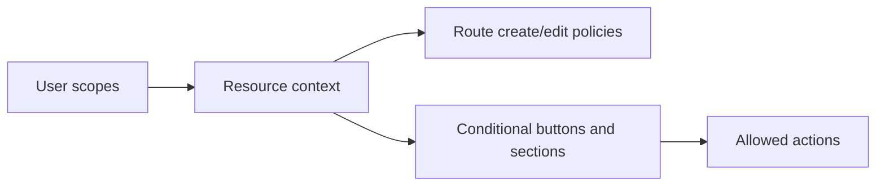

# Permissions and Scopes

<!-- codex:architecture-diagram:start -->
## Architecture Diagram

<!-- codex:architecture-diagram:end -->

Access control and permission management.

## User Scopes

Check user permissions:

```typescript
import { useUserScopes } from '@/packages/resource-framework/hooks/useUserScopes';

function AdminPanel() {
  const { hasScope, scopes } = useUserScopes();

  if (!hasScope('admin')) {
    return <AccessDenied />;
  }

  return <AdminContent />;
}
```

## Available Scopes

- `admin` - Full access
- `manager` - Management capabilities
- `user` - Standard user access
- `viewer` - Read-only access
- Custom scopes as needed

## Scope-based Actions

```typescript
function ResourceActions({ resource }) {
  const { hasScope } = useUserScopes();

  return (
    <>
      {hasScope('edit') && <EditButton resource={resource} />}
      {hasScope('delete') && <DeleteButton resource={resource} />}
      {hasScope('admin') && <AdminButton resource={resource} />}
    </>
  );
}
```

## Conditional Resource Access

```typescript
const route: ResourceRoute = {
  table: 'customers',
  create: {
    scope: 'admin',      // Only admins can create
    required: ['name']
  },
  edit: {
    scope: 'manager',    // Managers can edit
    enabled: true
  },
  rowActions: [
    {
      label: 'Delete',
      onClick: (row) => deleteCustomer(row.id),
      visible: (row, user) => user.hasScope('admin')
    }
  ]
};
```

## Organization-level Access

```typescript
import { useUserStore } from '@/lib/stores';

function ResourceContent() {
  const { user } = useUserStore();
  const resource = useResourceContext();

  // Only allow access if same organization
  if (resource.organization_id !== user.organization_id) {
    return <AccessDenied />;
  }

  return <Content />;
}
```

## API Authorization

Headers sent automatically:

```typescript
{
  'X-Organization-Id': user.organization_id,
  'X-Company-Id': user.company_id,
  'X-User-Id': user.user_id
}
```

## Permission Checks in Routes

```typescript
const route: ResourceRoute = {
  table: 'admin_logs',
  edit: {
    scope: 'admin',
    IgnoreCompanyCheckBeforeMutation: false
  },
  create: {
    scope: 'admin',
    required: ['action', 'user_id']
  }
};
```

## Dynamic Permissions

```typescript
function ResourceActions({ resource }) {
  const { user } = useUserStore();
  const canDelete = user.scopes.includes('admin') ||
    (user.scopes.includes('manager') && resource.owner_id === user.user_id);

  return (
    <>
      {canDelete && <DeleteButton />}
    </>
  );
}
```

## See Also

- [Hooks](./05-hooks.md)
- [Resource Routes](./02-resource-routes.md)

<!-- codex:architecture-review:start -->
## Architecture Assessment
- Technical debt rating: 4/5 - permissions are practical, but the model is mostly UI-driven and scope-string based.
- Refactor path: Introduce a formal capability model with explicit policy evaluation and backend parity.
- Replacement: A policy engine or permission service that returns capabilities per resource and action.
- Weak points: String-based scopes are easy to drift, frontend gating is not sufficient for security, and policy logic can end up duplicated.
<!-- codex:architecture-review:end -->
