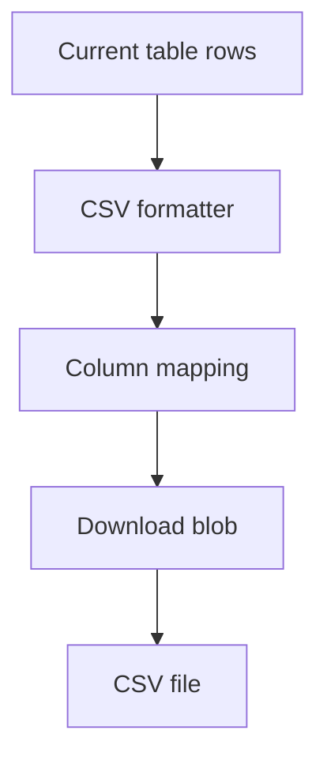

# CSV Export

<!-- codex:architecture-diagram:start -->
## Architecture Diagram

<!-- codex:architecture-diagram:end -->

Export resource data to CSV format.

## Basic Export

```typescript
import { exportAsCSV } from '@/packages/resource-framework/handlers/handle-csv-export';

function ExportButton() {
  const { data } = useApiClient({ table: 'customers' });

  const handleExport = () => {
    exportAsCSV(data, 'customers.csv');
  };

  return <button onClick={handleExport}>Export CSV</button>;
}
```

## Custom Column Selection

```typescript
const handleExport = () => {
  const columns = ['customer_id', 'name', 'email', 'status'];
  const csvData = data.map(row =>
    columns.reduce((obj, col) => {
      obj[col] = row[col];
      return obj;
    }, {})
  );
  exportAsCSV(csvData, 'customers.csv');
};
```

## Formatted Export

```typescript
const handleExport = () => {
  const formatted = data.map(row => ({
    'Customer ID': row.customer_id,
    'Name': row.name,
    'Email': row.email,
    'Status': row.status,
    'Created': new Date(row.created_at).toLocaleDateString()
  }));
  exportAsCSV(formatted, 'customers.csv');
};
```

## Large Dataset Export

```typescript
async function exportLargeDataset() {
  let allData = [];
  let page = 0;
  
  while (true) {
    const { data } = await fetchPage(page, 1000);
    if (data.length === 0) break;
    
    allData = [...allData, ...data];
    page++;
  }
  
  exportAsCSV(allData, 'full-export.csv');
}
```

## Export with Filters

```typescript
function FilteredExport() {
  const { data, filters } = useApiClient({
    table: 'customers',
    conditions: filters
  });

  return (
    <button onClick={() => exportAsCSV(data, `customers-filtered.csv`)}>
      Export Filtered
    </button>
  );
}
```

## Streaming Export

```typescript
import { createCSVStream } from '@/packages/resource-framework/utils/csv';

async function streamExport() {
  const stream = createCSVStream('customers.csv');
  
  for await (const row of dataIterator()) {
    stream.write(row);
  }
  
  stream.end();
}
```

## Custom Formatting

```typescript
function formatCell(value, column) {
  if (column === 'amount') {
    return `$${value.toFixed(2)}`;
  }
  if (column === 'created_at') {
    return new Date(value).toISOString();
  }
  return value;
}

const handleExport = () => {
  const formatted = data.map(row => ({
    ...row,
    ...Object.fromEntries(
      Object.entries(row).map(([k, v]) => [k, formatCell(v, k)])
    )
  }));
  exportAsCSV(formatted, 'export.csv');
};
```

## Excel Export

```typescript
import { exportAsExcel } from '@/packages/resource-framework/handlers/handle-csv-export';

function ExportButton() {
  const { data } = useApiClient({ table: 'customers' });

  return (
    <>
      <button onClick={() => exportAsCSV(data, 'data.csv')}>CSV</button>
      <button onClick={() => exportAsExcel(data, 'data.xlsx')}>Excel</button>
    </>
  );
}
```

## See Also

- [Data API](./07-data-api.md)
- [Utilities](./26-utilities.md)

<!-- codex:architecture-review:start -->
## Architecture Assessment
- Technical debt rating: 2/5 - CSV export is straightforward, but currently oriented around in-memory datasets.
- Refactor path: Separate small client-side exports from large server-side streaming exports.
- Replacement: A streaming export service for large resources plus a lightweight client export helper.
- Weak points: Large datasets can stress the browser, formatting logic can diverge from table display logic, and column selection is still mostly manual.
<!-- codex:architecture-review:end -->
