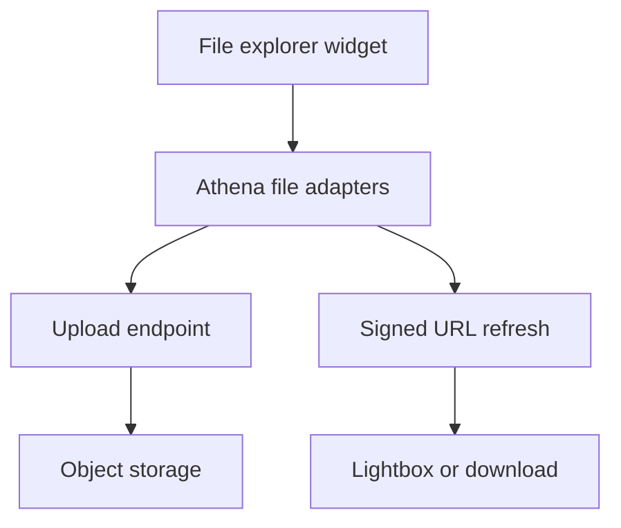

# File Explorer Widget

<!-- codex:architecture-diagram:start -->
## Architecture Diagram

<!-- codex:architecture-diagram:end -->

Manage files in resource drilldowns.

## Basic Usage

```typescript
{
  type: 'file_explorer',
  props: {
    title: 'Attachments',
    table: 'files',
    bucket: 'suitsconnect',
    conditions: [
      { eq_column: 'resource_id', eq_value: '{{resource_id}}' }
    ],
    objectPath: 'rsf/{{user.organization_id}}/customers/{{resource_id}}',
    allowUpload: true,
    allowDelete: true
  }
}
```

## S3 Storage Path

Files are stored using this path structure:

```
s3://suitsconnect/rsf/[organization_id]/[resource_name]/[resource_id]/[file_name].[file_extension]
```

Example:
```
s3://suitsconnect/rsf/org-123/customers/cust-456/invoice.pdf
s3://suitsconnect/rsf/org-123/invoices/inv-789/receipt.jpg
```

## Configuration

- `title`: Widget title
- `table`: File records table (typically 'files')
- `bucket`: S3 bucket name (typically 'suitsconnect')
- `conditions`: Filter conditions for related files
- `objectPath`: S3 path prefix (recommended: `rsf/{{user.organization_id}}/[resource_name]/{{resource_id}}`)
- `allowUpload`: Allow file uploads (default: true)
- `allowDelete`: Allow file deletion (default: true)
- `maxFileSizeMB`: Max file size in MB (default: 20)
- `acceptedTypes`: MIME types to accept (e.g., ['image/*', 'application/pdf'])
- `columns`: File columns to display

## Templates in Paths

Use template syntax to construct dynamic paths:

```typescript
{
  type: 'file_explorer',
  props: {
    // Recommended: Use the RSF path structure
    objectPath: 'rsf/{{user.organization_id}}/customers/{{resource_id}}',
    
    // This creates paths like:
    // rsf/org-123/customers/cust-456/document.pdf
  }
}
```

## S3 Client Configuration

```typescript
{
  type: 'file_explorer',
  props: {
    s3_client: {
      bucket_name: 'custom-bucket',
      access_key: '{{env.S3_ACCESS_KEY}}',
      secret_key: '{{env.S3_SECRET_KEY}}',
      provider: 'digital_ocean',  // or 'aws', 'hetzner', 'minio'
      base_url: 'https://nyc3.digitaloceanspaces.com',
      use_ssl: true
    }
  }
}
```

## File Display

Displayed columns:
- `filename` or `name` - File name
- `size` - File size in bytes
- `mime_type` or `mimeType` - File MIME type
- `created_at` or `createdAt` - Creation date
- `updated_at` or `updatedAt` - Update date
- `storage_key` - S3 storage key (path within bucket)

Example file record:
```typescript
{
  file_id: 'file-123',
  filename: 'invoice.pdf',
  size: 245000,
  mime_type: 'application/pdf',
  created_at: '2025-01-15T10:30:00Z',
  storage_key: 'rsf/org-123/customers/cust-456/invoice.pdf',
  url: 'https://presigned-url-to-s3-file'
}
```

## Upload Handling

```
Upload Flow:
1. User selects file(s)
2. Validate file size against maxFileSizeMB
3. Call `uploadFileViaAthena()` which POSTs multipart form data to the Athena-hosted `/api/upload` route with:
   - file (multipart)
   - resolvedOrganizationId
   - projectId
   - objectPath (template resolved)
4. Athena-backed file service:
   - Constructs S3 path: rsf/[org_id]/[resource_name]/[resource_id]/[filename]
   - Uploads to S3 at: s3://suitsconnect/[path]
   - Returns presigned URL (24 hour expiry)
5. Client:
   - Stores file metadata through the Athena CRUD adapter
   - Displays file in explorer
```

Files stored in S3:
```
s3://suitsconnect/rsf/org-123/customers/cust-456/invoice.pdf
s3://suitsconnect/rsf/org-123/customers/cust-456/receipt.jpg
```

Database metadata stored with:
- `storage_key`: The full S3 path
- `url`: Presigned URL for access
- `filename`, `size`, `mime_type`: File info


## Delete Handling

```
Delete Flow:
1. User clicks delete on file
2. Client confirms deletion
3. DELETE request sent with file_id
4. Server:
   - Deletes record from database
   - Deletes file from S3 at stored storage_key path
5. Client:
   - Updates file list
6. File is permanently removed
```

Example deletion:
```
- File: s3://suitsconnect/rsf/org-123/customers/cust-456/invoice.pdf
- Deleted from S3
- Record removed from database
- No recovery possible
```

## File Types

Automatically detected by extension:

- **Images**: jpg, jpeg, png, gif, webp, svg, bmp, ico
- **Documents**: pdf, doc, docx, txt, rtf, odt
- **Spreadsheets**: xls, xlsx, csv, ods
- **Archives**: zip, rar, 7z, tar, gz
- **Video**: mp4, avi, mov, wmv, webm, mkv
- **Audio**: mp3, wav, ogg, flac, aac

## View Modes

- List view (default)
- Grid view

## File Size Formatting

Automatic formatting:
- B (bytes)
- KB (kilobytes)
- MB (megabytes)

## Error Handling

- File size exceeded
- Invalid file type
- Upload failed
- Delete failed

## See Also

- [Widgets](./04-widgets.md)
- [Templating](./31-templating-system.md)
- [S3 Client Config](./29-s3-client-config.md)

<!-- codex:architecture-review:start -->
## Architecture Assessment
- Technical debt rating: 4/5 - file handling is materially useful but still spans widget UI, gateway routing, metadata rows, and storage behavior.
- Refactor path: Promote file operations into a dedicated file domain service with explicit lifecycle states.
- Replacement: A standalone file module with upload sessions, metadata persistence, and preview contracts.
- Weak points: Uploads and metadata writes can diverge, preview access depends on signed URL refresh, and storage-path conventions are implicit.
<!-- codex:architecture-review:end -->
