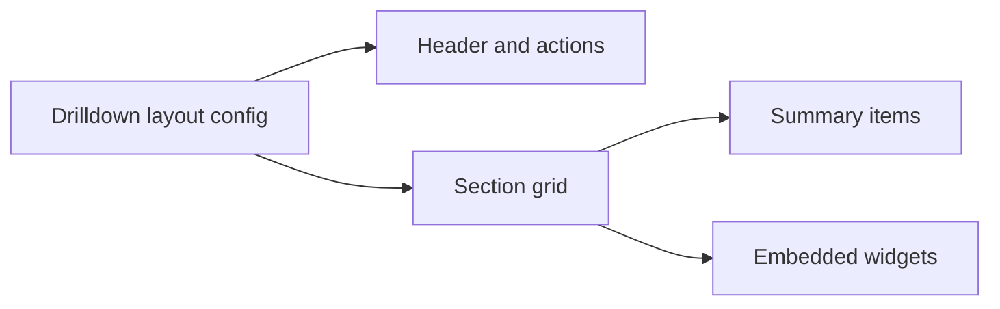

# Drilldown Layout

<!-- codex:architecture-diagram:start -->
## Architecture Diagram

<!-- codex:architecture-diagram:end -->

Layout system for resource drilldowns.

## Basic Layout

```typescript
import { DrilldownLayout } from '@/packages/resource-framework/components/drilldown/drilldown-layout';

function CustomerDrilldown() {
  return (
    <DrilldownLayout
      title="Customer Details"
      backLabel="Back to Customers"
      sections={[...]}
    />
  );
}
```

## Header Section

```typescript
<DrilldownLayout
  title="Customer: {{name}}"
  subtitle="Active since {{created_at}}"
  avatar={avatar}
  actions={[
    { label: 'Edit', onClick: handleEdit },
    { label: 'Delete', onClick: handleDelete }
  ]}
/>
```

## Multi-section Layout

```typescript
{
  sections: [
    {
      title: 'General',
      fields: ['name', 'email', 'phone']
    },
    {
      title: 'Address',
      columns: 2,
      fields: ['street', 'city', 'state', 'zip']
    },
    {
      title: 'Related',
      widgets: [
        { type: 'table', props: { resourceName: 'invoices' } }
      ]
    }
  ]
}
```

## Responsive Layout

Automatically adjusts for mobile:
- Full-width sections on mobile
- Multi-column on desktop
- Collapsible sections
- Swipeable tabs

## Sticky Header

```typescript
<DrilldownLayout
  title="Title"
  stickyHeader={true}  // Stays at top when scrolling
/>
```

## Section Collapse

```typescript
{
  sections: [
    {
      title: 'Advanced Options',
      collapsible: true,
      collapsed: true,  // Start collapsed
      fields: [...]
    }
  ]
}
```

## Padding

```typescript
<DrilldownLayout
  paddingTop={20}
  paddingBottom={100}
  paddingLeft={16}
  paddingRight={16}
/>
```

## Scroll Behavior

```typescript
// Auto-scroll to section
<button onClick={() => scrollToSection('address')}>
  Go to Address
</button>

// Smooth scrolling
{
  title: 'Details',
  id: 'address',
  smooth: true
}
```

## Empty States

```typescript
{
  title: 'Related Records',
  autoHideEmptyColumns: true,  // Hide if no data
  emptyMessage: 'No records found'
}
```

## Animation

```typescript
<DrilldownLayout
  animateIn={true}
  transitionDuration={300}
/>
```

## See Also

- [Sections](./10-sections.md)
- [Widgets](./04-widgets.md)

<!-- codex:architecture-review:start -->
## Architecture Assessment
- Technical debt rating: 3/5 - the layout abstraction is solid, but presentation policy is still coupled to resource route assumptions.
- Refactor path: Move toward slot-based composition with clearer layout primitives and reusable section containers.
- Replacement: A headless drilldown layout engine with render slots and host theming.
- Weak points: Header composition can get crowded, section layout rules are implicit, and customization paths can overlap.
<!-- codex:architecture-review:end -->
