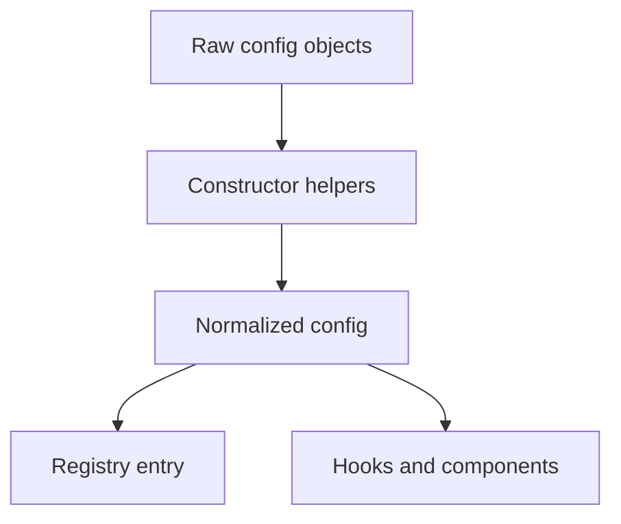

# Constructors

<!-- codex:architecture-diagram:start -->
## Architecture Diagram

<!-- codex:architecture-diagram:end -->

Helper functions for defining resources and columns.

## defineResourceRoute

Create a resource route:

```typescript
import { defineResourceRoute } from '@/packages/resource-framework/constructors/define-drizzle-resource-route';

export const customers = defineResourceRoute({
  table: 'customers',
  idColumn: 'id',
  columns: [
    'id',
    { column_name: 'name', header: 'Name' },
    { column_name: 'email', editable: { type: 'text' } }
  ],
  edit: { enabled: true },
  create: { scope: 'admin', required: ['name', 'email'] }
});
```

## defineColumns

Create column definitions:

```typescript
import { defineColumns } from '@/packages/resource-framework/constructors/define-columns';

const columns = defineColumns([
  { column_name: 'id', hidden: true },
  { column_name: 'name', header: 'Full Name' },
  { column_name: 'email', data_type: 'email' },
  {
    column_name: 'status',
    editable: {
      type: 'select',
      options: [
        { value: 'active', label: 'Active' },
        { value: 'inactive', label: 'Inactive' }
      ]
    }
  }
]);
```

## defineDrizzleResourceRoute

Define a route for Drizzle schema:

```typescript
import { defineDrizzleResourceRoute } from '@/packages/resource-framework/constructors/define-drizzle-resource-route';
import { customers } from '@/drizzle/schema';

export const customersRoute = defineDrizzleResourceRoute({
  drizzleTable: customers,
  path: '/customers',
  searchBy: 'name'
});
```

## defineEditableColumn

Mark a column as editable:

```typescript
defineEditableColumn('status', {
  type: 'select',
  update_table: 'customers',
  update_column: 'status',
  options: [...]
});
```

## defineFormattedColumn

Define a formatted column:

```typescript
defineFormattedColumn('created_at', {
  data_type: 'date',
  formatter: (value) => new Date(value).toLocaleDateString(),
  header: 'Created'
});
```

## Type Inference

All constructors use TypeScript generics:

```typescript
const route = defineResourceRoute({
  table: 'customers',
  idColumn: 'id',
  columns: [...]
  // TypeScript knows the shape and validates
});
```

## Combining Constructors

```typescript
const columns = defineColumns([
  defineFormattedColumn('created_at', {...}),
  defineEditableColumn('status', {...})
]);

const route = defineResourceRoute({
  table: 'customers',
  columns
});
```

## See Also

- [Resource Routes](./02-resource-routes.md)
- [Columns](./09-columns.md)

<!-- codex:architecture-review:start -->
## Architecture Assessment
- Technical debt rating: 2/5 - constructors already reduce repetition, but they still rely on convention-heavy input.
- Refactor path: Add stronger runtime validation and clearer error output for malformed constructor input.
- Replacement: Schema-backed builders with compile-time inference and runtime parsing.
- Weak points: Constructors improve ergonomics but cannot fully prevent invalid semantics when many optional branches are allowed.
<!-- codex:architecture-review:end -->
