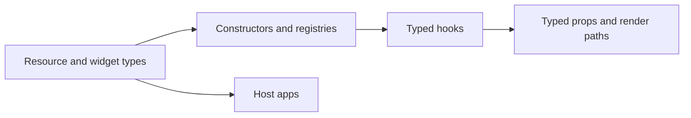

# Type Safety

<!-- codex:architecture-diagram:start -->
## Architecture Diagram

<!-- codex:architecture-diagram:end -->

TypeScript support throughout the framework.

## Resource Types

```typescript
import type {
  ResourceRoute,
  ResourceDrilldownRoute,
  DrilldownSectionConfig,
  ColumnConfig,
  FileExplorerWidgetSpec
} from '@/packages/resource-framework/resource-types';

// Fully typed configurations
const route: ResourceRoute = {
  table: 'customers',
  idColumn: 'id'
  // TypeScript will catch missing required fields
};
```

## Hook Types

```typescript
import type { ApiClientResult } from '@/packages/resource-framework/hooks/use-api-client';

const result: ApiClientResult = useApiClient({...});
// Knows: data, isLoading, insert, remove types
```

## Component Props

```typescript
import type { ResourceTableProps } from '@/packages/resource-framework/components/ResourceTable';

const props: ResourceTableProps = {
  resourceName: 'customers'
  // Only valid resource names allowed
};
```

## Template Types

```typescript
import type { TemplateContext, TemplateOptions } from '@/packages/resource-framework/templating/types';

const context: TemplateContext = {
  entity: row,
  user,
  idColumn: 'id'
};

const result = resolveTemplate(template, context);
```

## Widget Types

```typescript
import type {
  TableWidgetSpec,
  FileExplorerWidgetSpec,
  JsonWidgetSpec
} from '@/packages/resource-framework/resource-types';

// Discriminated union - type safe widget specs
const widget: FileExplorerWidgetSpec = {
  type: 'file_explorer',
  props: {
    table: 'files'
    // Only file_explorer valid props
  }
};
```

## Filter Types

```typescript
import type {
  FilterOperator,
  FilterDefinition,
  FilterRegistry
} from '@/packages/resource-framework/resource-types';

const ops: FilterOperator[] = ['eq', 'neq', 'contains'];
```

## Edit State Types

```typescript
import type { EditStateValue } from '@/packages/resource-framework/hooks/useEditState';

const changes: Record<string, EditStateValue> = {
  name: 'New Name',
  status: 'active'
};
```

## Strict Mode

Enable TypeScript strict mode:

```json
{
  "compilerOptions": {
    "strict": true,
    "strictNullChecks": true,
    "strictFunctionTypes": true,
    "strictBindCallApply": true,
    "strictPropertyInitialization": true
  }
}
```

## Generic Types

```typescript
// Customize data types
interface CustomData {
  customer_id: string;
  name: string;
  email: string;
}

const { data } = useApiClient<CustomData>({
  table: 'customers'
});
// data is typed as CustomData[]
```

## See Also

- [Architecture](./01-architecture.md)

<!-- codex:architecture-review:start -->
## Architecture Assessment
- Technical debt rating: 3/5 - the type surface is broad, but not everything is generated from a single source of truth.
- Refactor path: Generate more types from Drizzle or OpenAPI metadata and reduce manually synchronized interfaces.
- Replacement: Schema-generated types and validators shared between runtime and package declarations.
- Weak points: Manual interfaces can drift, app-only aliases bleed into package code, and deep import usage weakens type-surface discipline.
<!-- codex:architecture-review:end -->
