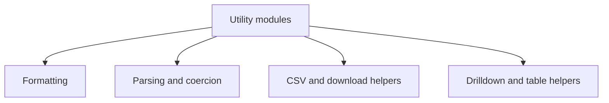

# Utilities

<!-- codex:architecture-diagram:start -->
## Architecture Diagram

<!-- codex:architecture-diagram:end -->

Utility functions and helpers.

## String Utilities

```typescript
import {
  toCamelCase,
  toSnakeCase,
  formatString,
  truncate,
  capitalize
} from '@/packages/resource-framework/utils/string';

toCamelCase('customer_id');        // 'customerId'
toSnakeCase('customerId');          // 'customer_id'
capitalize('john');                 // 'John'
truncate('Very long string', 10);  // 'Very lon...'
```

## Number Utilities

```typescript
import {
  formatCurrency,
  formatPercent,
  abbreviateNumber
} from '@/packages/resource-framework/utils/number-utils';

formatCurrency(1234.56);    // '$1,234.56'
formatPercent(0.95);        // '95%'
abbreviateNumber(1000000);  // '1M'
```

## Date Utilities

```typescript
import {
  formatDate,
  formatTime,
  formatRelative,
  parseDate
} from '@/packages/resource-framework/utils/date-utils';

formatDate(new Date());        // '01/15/2025'
formatTime(new Date());        // '2:30 PM'
formatRelative(new Date());    // 'Just now', '2 hours ago'
```

## Key Case

```typescript
import {
  getValueByKeyCase,
  getValueByPathCase
} from '@/packages/resource-framework/utils/key-case';

// Case-insensitive property access
getValueByKeyCase({ customerId: '1' }, 'customer_id'); // '1'
getValueByPathCase(obj, 'user.profile.name');          // nested access
```

## Display Config

```typescript
import { getDisplayConfig } from '@/packages/resource-framework/utils/display-config';

const config = getDisplayConfig('customers');
// Returns: { columns, formatters, icons, colors }
```

## Coercion

```typescript
import { coerceValue } from '@/packages/resource-framework/utils/coerce';

coerceValue('42', 'number');       // 42
coerceValue('true', 'boolean');    // true
coerceValue('2025-01-15', 'date'); // Date object
```

## CSV

```typescript
import { parseCSV, generateCSV } from '@/packages/resource-framework/utils/csv';

const data = parseCSV(csvString);
const csv = generateCSV(jsonData);
```

## Query Parser

```typescript
import { parseQueryString } from '@/packages/resource-framework/utils/query-parser';

const params = parseQueryString('?sort=name&page=2');
// { sort: 'name', page: '2' }
```

## Dork Query

```typescript
import { parseDorkQuery } from '@/packages/resource-framework/utils/dork-query';

const query = parseDorkQuery('status:active -archived');
// { status: 'active', _not: ['archived'] }
```

## Category Grouping

```typescript
import { groupByCategory } from '@/packages/resource-framework/utils/categories';

const grouped = groupByCategory(items, 'category');
// { 'group1': [...], 'group2': [...] }
```

## Helpers

```typescript
import { debounce, throttle, memoize } from '@/packages/resource-framework/utils/helpers';

const debouncedFn = debounce(fn, 300);
const throttledFn = throttle(fn, 1000);
const memoizedFn = memoize(fn);
```

## Format

```typescript
import { formatPhoneNumber, formatZipCode } from '@/packages/resource-framework/utils/format';

formatPhoneNumber('5551234567');  // '(555) 123-4567'
formatZipCode('12345');           // '12345'
```

## See Also

- [Format](./26-format.md)

<!-- codex:architecture-review:start -->
## Architecture Assessment
- Technical debt rating: 4/5 - utilities are useful but represent classic gravitational technical debt when unrelated helpers accumulate.
- Refactor path: Group utilities into narrower domain modules and enforce stricter ownership boundaries.
- Replacement: Small focused packages or namespaces by domain concern instead of a broad utils bucket.
- Weak points: Discovery becomes harder over time, low-signal helpers mix with critical helpers, and shared util files invite accidental coupling.
<!-- codex:architecture-review:end -->
