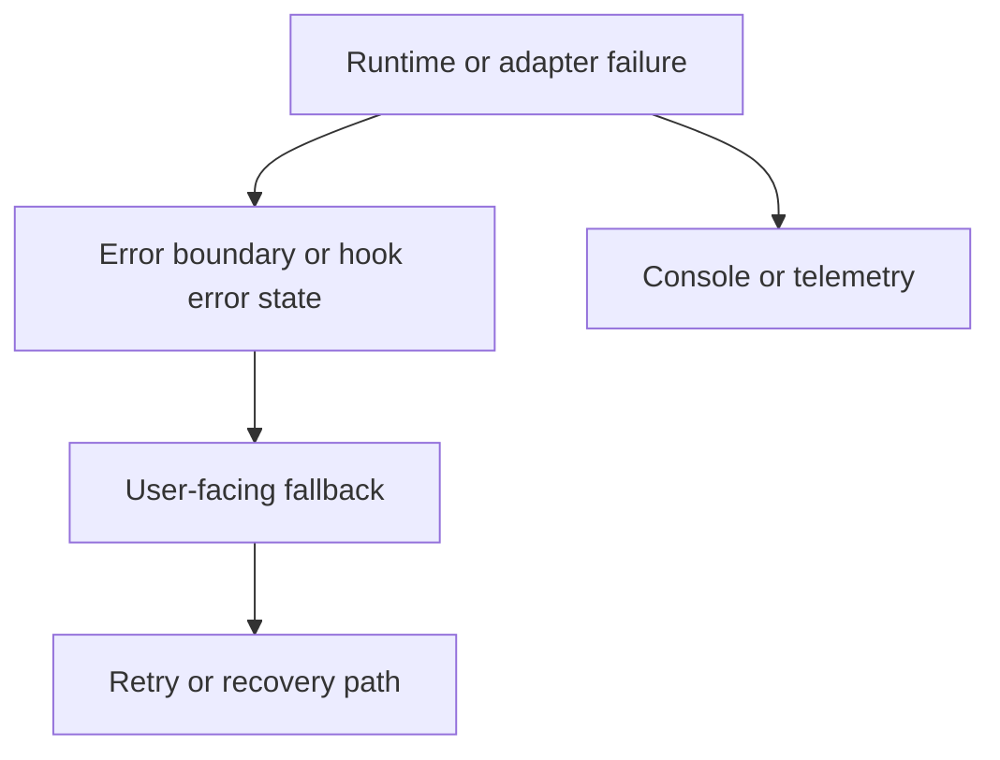

# Error Handling

<!-- codex:architecture-diagram:start -->
## Architecture Diagram

<!-- codex:architecture-diagram:end -->

Error management and recovery.

## Error Boundaries

```typescript
import { ErrorBoundary } from 'react-error-boundary';

function App() {
  return (
    <ErrorBoundary
      FallbackComponent={ErrorFallback}
      onError={(error, info) => {
        console.error('Error:', error);
        logErrorToService(error, info);
      }}
    >
      <ResourceDrilldown />
    </ErrorBoundary>
  );
}

function ErrorFallback({ error, resetErrorBoundary }) {
  return (
    <div>
      <h1>Something went wrong</h1>
      <pre>{error.message}</pre>
      <button onClick={resetErrorBoundary}>Try again</button>
    </div>
  );
}
```

## API Error Handling

```typescript
const { data, error, isLoading } = useApiClient({
  table: 'customers'
});

if (error) {
  return (
    <div className="error">
      <h3>Error loading data</h3>
      <p>{error.message}</p>
      <button onClick={() => refetch()}>Retry</button>
    </div>
  );
}
```

## Validation Errors

```typescript
const { errors, validate } = useEditState(data, {
  validatorFn: (data) => {
    const errs = {};
    if (!data.name) errs.name = 'Name is required';
    if (data.email && !isValidEmail(data.email)) {
      errs.email = 'Invalid email address';
    }
    return errs;
  }
});

if (Object.keys(errors).length > 0) {
  return <ValidationErrors errors={errors} />;
}
```

## Network Error Recovery

```typescript
async function withRetry(fn, maxRetries = 3) {
  for (let i = 0; i < maxRetries; i++) {
    try {
      return await fn();
    } catch (error) {
      if (i === maxRetries - 1) throw error;
      await new Promise(r => setTimeout(r, 1000 * Math.pow(2, i)));
    }
  }
}

const data = await withRetry(() =>
  executeDataApi({ table: 'customers' })
);
```

## User Notifications

```typescript
import { useNotification } from '@/components/notifications/base';

const { notification } = useNotification();

try {
  await updateResource(data);
  notification({
    message: 'Successfully updated',
    success: true
  });
} catch (error) {
  notification({
    message: `Failed: ${error.message}`,
    success: false
  });
}
```

## Graceful Degradation

```typescript
function ResourceTable({ data, columns }) {
  try {
    return <Table data={data} columns={columns} />;
  } catch (error) {
    return <SimpleFallback data={data} />;
  }
}
```

## Logging

```typescript
function logError(error, context) {
  const timestamp = new Date().toISOString();
  const message = {
    timestamp,
    error: error.message,
    stack: error.stack,
    context,
    userAgent: navigator.userAgent
  };

  // Send to logging service
  fetch('/api/logs', {
    method: 'POST',
    body: JSON.stringify(message)
  });
}
```

## Toast Notifications

```typescript
const { toast } = useToast();

try {
  await deleteResource(id);
  toast({
    title: 'Success',
    description: 'Resource deleted',
    variant: 'default'
  });
} catch (error) {
  toast({
    title: 'Error',
    description: error.message,
    variant: 'destructive'
  });
}
```

## See Also

- [Hooks](./05-hooks.md)
- [Components](./06-components.md)

<!-- codex:architecture-review:start -->
## Architecture Assessment
- Technical debt rating: 4/5 - error handling exists in multiple layers, but there is no single typed error model across the framework.
- Refactor path: Introduce an error taxonomy and standardize retryable vs terminal failures across adapters and UI.
- Replacement: Typed framework errors with shared normalization, logging, and presentation helpers.
- Weak points: Raw backend errors still surface in places, retry policy is inconsistent, and UI fallback behavior varies by component.
<!-- codex:architecture-review:end -->
