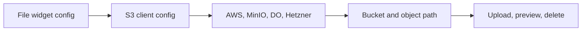

# S3 Client Configuration

<!-- codex:architecture-diagram:start -->
## Architecture Diagram

<!-- codex:architecture-diagram:end -->

Configure S3/object storage access in file explorers.

## Default Configuration

By default, files are stored in the `suitsconnect` bucket at:

```
s3://suitsconnect/rsf/[organization_id]/[resource_name]/[resource_id]/[filename].[ext]
```

Example paths:
```
s3://suitsconnect/rsf/org-123/customers/cust-456/invoice.pdf
s3://suitsconnect/rsf/org-123/invoices/inv-789/receipt.jpg
```

The default configuration uses environment variables:

```bash
MINIO_ENDPOINT=https://minio.example.com:9000
MINIO_ACCESS_KEY=xxxxx
MINIO_SECRET_KEY=xxxxx
MINIO_USE_SSL=true
MINIO_BUCKET=suitsconnect
```

## Custom S3 Client Configuration

Override default storage with custom providers:

```typescript
{
  type: 'file_explorer',
  props: {
    s3_client: {
      bucket_name: 'custom-bucket',
      access_key: '{{env.CUSTOM_ACCESS_KEY}}',
      secret_key: '{{env.CUSTOM_SECRET_KEY}}',
      provider: 'aws',  // or digital_ocean, hetzner, minio
      base_url: 'https://s3.amazonaws.com',
      use_ssl: true
    }
  }
}
```

## Providers Supported

- `aws` - Amazon S3
- `digital_ocean` - DigitalOcean Spaces
- `hetzner` - Hetzner Object Storage
- `minio` - MinIO S3-compatible storage

## AWS Configuration

```typescript
{
  bucket_name: 'my-bucket',
  access_key: process.env.AWS_ACCESS_KEY_ID,
  secret_key: process.env.AWS_SECRET_ACCESS_KEY,
  provider: 'aws',
  base_url: 'https://s3.amazonaws.com',
  use_ssl: true
}
```

## DigitalOcean Spaces

```typescript
{
  bucket_name: 'my-space',
  access_key: process.env.DO_ACCESS_KEY,
  secret_key: process.env.DO_SECRET_KEY,
  provider: 'digital_ocean',
  base_url: 'https://nyc3.digitaloceanspaces.com',
  use_ssl: true
}
```

## Hetzner Object Storage

```typescript
{
  bucket_name: 'my-bucket',
  access_key: process.env.HETZNER_ACCESS_KEY,
  secret_key: process.env.HETZNER_SECRET_KEY,
  provider: 'hetzner',
  base_url: 'https://fsn1.your-objectstorage.com',
  use_ssl: true
}
```

## MinIO Configuration

```typescript
{
  bucket_name: 'suitsconnect',
  access_key: process.env.MINIO_ACCESS_KEY,
  secret_key: process.env.MINIO_SECRET_KEY,
  provider: 'minio',
  base_url: 'https://minio.example.com:9000',
  use_ssl: true
}
```

## Environment Variables

```bash
# AWS
AWS_ACCESS_KEY_ID=xxxxx
AWS_SECRET_ACCESS_KEY=xxxxx

# DigitalOcean
DO_ACCESS_KEY=xxxxx
DO_SECRET_KEY=xxxxx

# Hetzner
HETZNER_ACCESS_KEY=xxxxx
HETZNER_SECRET_KEY=xxxxx

# MinIO
MINIO_ACCESS_KEY=xxxxx
MINIO_SECRET_KEY=xxxxx
MINIO_ENDPOINT=https://minio.example.com:9000
```

## Template Support

Use environment variables in config:

```typescript
{
  bucket_name: '{{env.S3_BUCKET}}',
  access_key: '{{env.S3_ACCESS_KEY}}',
  secret_key: '{{env.S3_SECRET_KEY}}',
  provider: '{{env.S3_PROVIDER}}',
  base_url: '{{env.S3_BASE_URL}}'
}
```

## Security

- Credentials never exposed to client
- Only transmitted over HTTPS
- Server-side configuration only
- Use IAM roles when possible
- Rotate credentials regularly

## Custom Endpoints

```typescript
{
  provider: 'minio',
  base_url: 'https://custom-domain.com:9000',
  use_ssl: true,
  region: 'us-east-1'  // Optional
}
```

## See Also

- [File Explorer Widget](./20-file-explorer-widget.md)
- [Templating](./30-templating.md)

<!-- codex:architecture-review:start -->
## Architecture Assessment
- Technical debt rating: 3/5 - storage config is practical, but still provider-centric and embedded in widget docs rather than a stronger storage abstraction.
- Refactor path: Separate storage provider configuration from file widget behavior and path conventions.
- Replacement: A provider-agnostic storage config object plus a storage adapter registry.
- Weak points: Credential handling is sensitive, object path rules are convention-based, and provider differences can leak into UI config.
<!-- codex:architecture-review:end -->
