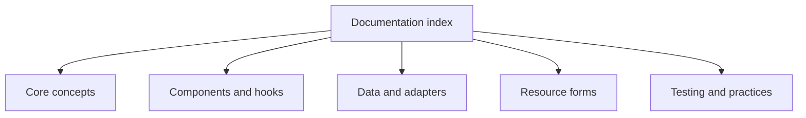

# Documentation Index

<!-- codex:architecture-diagram:start -->
## Architecture Diagram

<!-- codex:architecture-diagram:end -->

Complete documentation for the Resource Framework.

## Getting Started

- [Overview](./overview.md) - Framework overview and structure
- [Architecture](./01-architecture.md) - Layered design and core concepts
- [Best Practices](./31-best-practices.md) - Guidelines and recommendations

## Core Concepts

- [Resource Routes](./02-resource-routes.md) - Define resources
- [Drilldown Routes](./03-drilldown-routes.md) - Define detail views
- [Sections](./10-sections.md) - Logical groupings in drilldowns
- [Fields](./11-fields.md) - Individual data display
- [Columns](./09-columns.md) - Table columns configuration

## Components & Hooks

- [Components](./06-components.md) - Reusable React components
- [Hooks](./05-hooks.md) - React hooks for resource operations
- [ResourceProvider](./13-resource-provider.md) - Context wrapper
- [Resource Forms](./38-resource-forms.md) - Persisted form contract and runtime model
- [Form Builder And Renderer](./39-form-builder-renderer.md) - Builder-time vs runtime APIs

## Widgets

- [Widgets](./04-widgets.md) - Widget overview
- [File Explorer Widget](./20-file-explorer-widget.md) - File management
- [Widget Registry](./12-registries.md#widget-registry) - Widget registration

## Data & API

- [Data API](./07-data-api.md) - CRUD operations
- [HTTP Adapters](./08-http-adapters.md) - API communication
- [Filters](./15-filters.md) - Data filtering
- [Search](./16-search.md) - Search functionality
- [Sorting & Pagination](./17-sorting-pagination.md) - Data organization

## Templates & Configuration

- [Templating System](./30-templating.md) - Dynamic value resolution
- [Templating Details](../templating/README.md) - Complete templating guide
- [S3 Configuration](./29-s3-config.md) - Cloud storage setup

## Development

- [Type Safety](./23-type-safety.md) - TypeScript support
- [Constructors](./22-constructors.md) - Helper functions
- [Utilities](./26-utilities.md) - Utility functions
- [Formatting](./27-formatting.md) - Data formatting
- [Testing](./25-testing.md) - Testing strategies
- [Testing Guide](./35-testing-guide.md) - Comprehensive framework and templating testing playbook

## Advanced Topics

- [Edit State](./14-edit-state.md) - Form state management
- [Permissions](./18-permissions.md) - Access control
- [Performance](./24-performance.md) - Optimization strategies
- [Error Handling](./28-error-handling.md) - Error management
- [CSV Export](./19-csv-export.md) - Data export
- [Drilldown Layout](./21-drilldown-layout.md) - Layout system
- [Registries](./12-registries.md) - Centralized configuration

## Deep Reference & Operations

- [Complete Technical Reference](./40-complete-reference.md) - End-to-end architecture, contracts, extension points, and release expectations
- [Athena Migration Runbook](./41-athena-migration-runbook.md) - Controlled rollout/rollback and verification strategy for Athena cutover
- [Resource Forms Operations Guide](./42-resource-forms-operations.md) - Lifecycle governance for schema, versioning, and submission migration
- [Troubleshooting Playbook](./43-troubleshooting-playbook.md) - Practical diagnosis and deterministic fix patterns

## Quick Links

### Common Tasks

1. **Define a new resource**
   - Read [Resource Routes](./02-resource-routes.md)
   - Use [defineResourceRoute](./22-constructors.md) constructor

2. **Create a drilldown view**
   - Read [Drilldown Routes](./03-drilldown-routes.md)
   - Define [Sections](./10-sections.md) and [Widgets](./04-widgets.md)

3. **Add file management**
   - Use [File Explorer Widget](./20-file-explorer-widget.md)
   - Configure [S3](./29-s3-config.md)

4. **Implement dynamic configuration**
   - Use [Templates](./30-templating.md)
   - Learn [Strategy patterns](../templating/README.md)

5. **Handle user permissions**
   - Read [Permissions](./18-permissions.md)
   - Use scope-based access

### API Reference

- [Hooks API](./05-hooks.md#api-reference)
- [Data API](./07-data-api.md#core-methods)
- [Templating API](./30-templating.md#basic-usage)
- [Component Props](./06-components.md)

### Configuration Examples

- [Resource Route Example](./02-resource-routes.md#basic-definition)
- [Drilldown Example](./03-drilldown-routes.md#basic-structure)
- [Widget Example](./04-widgets.md#built-in-widgets)
- [Template Example](./30-templating.md#configuration-examples)

## File Structure

```
packages/resource-framework/
├── docs/
│   ├── overview.md
│   ├── 01-architecture.md
│   ├── 02-resource-routes.md
│   ├── 03-drilldown-routes.md
│   ├── 04-widgets.md
│   ├── 05-hooks.md
│   ├── 06-components.md
│   ├── 07-data-api.md
│   ├── 08-http-adapters.md
│   ├── 09-columns.md
│   ├── 10-sections.md
│   ├── 11-fields.md
│   ├── 12-registries.md
│   ├── 13-resource-provider.md
│   ├── 14-edit-state.md
│   ├── 15-filters.md
│   ├── 16-search.md
│   ├── 17-sorting-pagination.md
│   ├── 18-permissions.md
│   ├── 19-csv-export.md
│   ├── 20-file-explorer-widget.md
│   ├── 21-drilldown-layout.md
│   ├── 22-constructors.md
│   ├── 23-type-safety.md
│   ├── 24-performance.md
│   ├── 25-testing.md
│   ├── 26-utilities.md
│   ├── 27-formatting.md
│   ├── 28-error-handling.md
│   ├── 29-s3-config.md
│   ├── 30-templating.md
│   ├── 31-best-practices.md
│   ├── 40-complete-reference.md
│   ├── 41-athena-migration-runbook.md
│   ├── 42-resource-forms-operations.md
│   ├── 43-troubleshooting-playbook.md
│   ├── 38-resource-forms.md
│   ├── 39-form-builder-renderer.md
│   └── 32-index.md (you are here)
├── components/
├── hooks/
├── templating/
├── resource-types.ts
├── README.md
└── ...
```

## Search Tips

- Use Ctrl+F to search within each doc
- File names indicate the topic (e.g., 20-file-explorer-widget.md)
- See Also sections link related topics
- Cross-references use standard Markdown links (example: `Text -> ./target-doc.md`).

## Contributing

When adding new documentation:
1. Follow the numbering scheme
2. Include See Also section
3. Add entry to this index
4. Keep examples practical and concrete

## Version History

- Latest: Resource Framework with full templating system
- See [templating/README.md](../templating/README.md) for templating changelog

<!-- codex:architecture-review:start -->
## Architecture Assessment
- Technical debt rating: 1/5 - the index is low-risk, but it should ideally be generated to avoid stale links and categorization drift.
- Refactor path: Generate the index from frontmatter or a docs manifest.
- Replacement: A docs-site navigation config or generated Markdown index.
- Weak points: Manual indexes become stale, and cross-page relationships can be underspecified as docs grow.
<!-- codex:architecture-review:end -->
