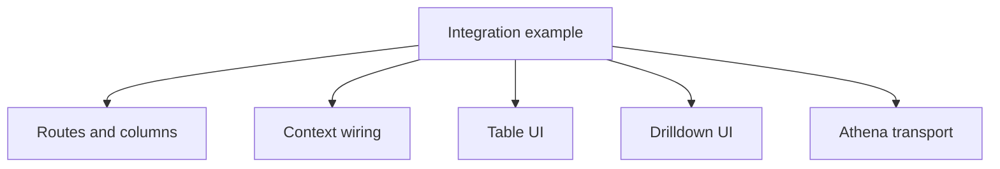

# Integration Examples

<!-- codex:architecture-diagram:start -->
## Architecture Diagram

<!-- codex:architecture-diagram:end -->

Real-world examples of using the Resource Framework.

## Complete Resource Setup

```typescript
// routes/customers.ts
import { defineResourceRoute, defineColumns } from '@/packages/resource-framework/constructors';

export const customersRoute = defineResourceRoute({
  table: 'customers',
  idColumn: 'customer_id',
  path: '/customers',
  searchBy: 'name',
  
  columns: defineColumns([
    { column_name: 'customer_id', hidden: true },
    { column_name: 'name', header: 'Customer Name', order: 1 },
    {
      column_name: 'email',
      header: 'Email',
      editable: { type: 'text' },
      order: 2
    },
    {
      column_name: 'status',
      header: 'Status',
      editable: {
        type: 'select',
        options: [
          { value: 'active', label: 'Active' },
          { value: 'inactive', label: 'Inactive' }
        ]
      },
      order: 3
    }
  ]),
  
  edit: { enabled: true, scope: 'manager' },
  create: {
    scope: 'admin',
    required: ['name', 'email'],
    columns: [
      { column_name: 'name' },
      { column_name: 'email' },
      { column_name: 'status' }
    ]
  },
  
  rowActions: [
    {
      label: 'View',
      onClick: (row) => navigate(`/customers/${row.customer_id}`)
    },
    {
      label: 'Email',
      onClick: (row) => window.location.href = `mailto:${row.email}`
    },
    {
      label: 'Delete',
      onClick: (row) => deleteCustomer(row.customer_id),
      destructive: true
    }
  ]
});
```

## Complete Drilldown Setup

```typescript
// drilldown/customers.ts
import { RESOURCE_DRILLDOWN_ROUTES } from '@/packages/resource-framework/registries';

RESOURCE_DRILLDOWN_ROUTES['customers'] = {
  title: (row) => `Customer: {{name}}`,
  
  sections: [
    {
      title: 'Overview',
      columns: 2,
      fields: ['name', 'email', 'phone', 'status']
    },
    {
      title: 'Address',
      columns: 2,
      fields: ['street', 'city', 'state', 'zip', 'country']
    },
    {
      title: 'Recent Invoices',
      columns: 1,
      fields: [],
      widgets: [
        {
          type: 'table',
          props: {
            resourceName: 'invoices',
            title: 'Recent Invoices',
            titleSize: 'small',
            conditions: [
              { eq_column: 'customer_id', eq_value: '{{resource_id}}' }
            ],
            enableSearch: true,
            limit: 10,
            columns: ['invoice_id', 'amount', 'status', 'created_at']
          }
        }
      ]
    },
    {
      title: 'Attachments',
      columns: 1,
      fields: [],
      widgets: [
        {
          type: 'file_explorer',
          props: {
            title: 'Files',
            table: 'files',
            bucket: 'suitsconnect',
            conditions: [
              { eq_column: 'customer_id', eq_value: '{{resource_id}}' }
            ],
            objectPath: 'customers/{{resource_id}}/files',
            allowUpload: true,
            allowDelete: true,
            maxFileSizeMB: 50
          }
        }
      ]
    }
  ]
};
```

## Table Page

```typescript
// pages/customers.tsx
import { ResourceTable } from '@/packages/resource-framework/components/ResourceTable';
import { CreateResourceButton } from '@/packages/resource-framework/components/create-resource-button';

export default function CustomersPage() {
  return (
    <div className="p-6">
      <div className="flex justify-between items-center mb-4">
        <h1>Customers</h1>
        <CreateResourceButton resourceName="customers" />
      </div>
      <ResourceTable resourceName="customers" />
    </div>
  );
}
```

## Detail Page

```typescript
// pages/customers/[id].tsx
import { ResourceProvider } from '@/packages/resource-framework/components/ResourceProvider';
import { ResourceDrilldown } from '@/packages/resource-framework/components/ResourceDrilldown';

export default function CustomerDetailPage({ id }) {
  return (
    <ResourceProvider resourceName="customers" resourceId={id}>
      <ResourceDrilldown />
    </ResourceProvider>
  );
}
```

## Custom Widget Integration

```typescript
// components/CustomMetricsWidget.tsx
function CustomMetricsWidget({ spec, entity }) {
  return (
    <div className="grid grid-cols-3 gap-4">
      <MetricCard
        label="Total Invoices"
        value={entity.invoice_count}
      />
      <MetricCard
        label="Total Revenue"
        value={formatCurrency(entity.total_revenue)}
      />
      <MetricCard
        label="Active Status"
        value={entity.status}
      />
    </div>
  );
}

// Register it
registerSectionWidget('metrics', CustomMetricsWidget);

// Use in drilldown
widgets: [
  {
    type: 'metrics',
    props: { title: 'Metrics' }
  }
]
```

## See Also

- [Resource Routes](./02-resource-routes.md)
- [Drilldown Routes](./03-drilldown-routes.md)
- [Components](./06-components.md)
- [Widgets](./04-widgets.md)

<!-- codex:architecture-review:start -->
## Architecture Assessment
- Technical debt rating: 3/5 - examples are useful, but they are static and can drift from the codebase if not exercised.
- Refactor path: Back examples with runnable fixtures or sample apps.
- Replacement: Executable playground examples or tested snippets generated from the sample apps.
- Weak points: Copy-paste examples can decay, hidden setup assumptions are common, and readers may not know which parts are illustrative vs required.
<!-- codex:architecture-review:end -->
