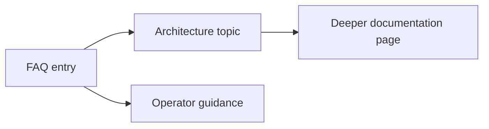

# FAQ

<!-- codex:architecture-diagram:start -->
## Architecture Diagram

<!-- codex:architecture-diagram:end -->

Frequently asked questions about the Resource Framework.

## Getting Started

**Q: Where do I start?**
A: Start with [Overview](./overview.md) and [Architecture](./01-architecture.md) to understand the framework structure.

**Q: How do I create a new resource?**
A: Use [defineResourceRoute](./22-constructors.md) constructor and define it in resource-routes.ts. See [Resource Routes](./02-resource-routes.md) for details.

**Q: What's the difference between routes and drilldowns?**
A: Routes define how resources appear in tables. Drilldowns define the detail view when you click into a resource.

## Configuration

**Q: Can I use dynamic values in configuration?**
A: Yes, use the [Templating System](./30-templating.md) with `{{prefix.key}}` syntax.

**Q: How do I access environment variables?**
A: Use `{{env.VARIABLE_NAME}}` in configuration. See [Templating](./30-templating.md).

**Q: How do I add file upload capability?**
A: Use the [File Explorer Widget](./20-file-explorer-widget.md) in your drilldown sections.

## Permissions & Security

**Q: How do I restrict access to certain resources?**
A: Use the `scope` property in routes and check [Permissions](./18-permissions.md).

**Q: Are API credentials secure?**
A: Yes. Environment variables are only accessible on the server, and headers are sent securely.

## Performance

**Q: How do I handle large datasets?**
A: Use [Pagination](./17-sorting-pagination.md) and set appropriate `limit` values.

**Q: Should I cache API responses?**
A: Caching is enabled by default. Disable when needed with `cache_enabled: false`.

**Q: What's the best page size for pagination?**
A: Typically 10-50 records. Use higher for large result sets. See [Best Practices](./31-best-practices.md).

## Data & API

**Q: How do I fetch data?**
A: Use the [useApiClient](./05-hooks.md#useapiclient) hook. See [Data API](./07-data-api.md).

**Q: How do I handle API errors?**
A: Use [Error Boundaries](./28-error-handling.md) and check the error state from hooks.

**Q: Can I update multiple records at once?**
A: Yes, use [Batch Updates](./24-performance.md#batch-updates).

## Components & Hooks

**Q: What's the difference between ResourceTable and ResourceDrilldown?**
A: ResourceTable displays lists. ResourceDrilldown displays detail views.

**Q: When should I use ResourceProvider?**
A: Use it to provide resource context to nested components in detail views.

**Q: Can I create custom hooks?**
A: Yes, but consider using existing hooks first. See [Hooks](./05-hooks.md).

## Widgets

**Q: Can I create custom widgets?**
A: Yes. Implement the widget interface and register it with `registerSectionWidget`.

**Q: What widgets are available?**
A: Table, JSON, and File Explorer. See [Widgets](./04-widgets.md).

**Q: How do I pass data to widgets?**
A: Through the `props` object. Use templates for dynamic values.

## Templating

**Q: What template prefixes are available?**
A: `{{env.XXX}}`, `{{user.XXX}}`, `{{resource.XXX}}`, and direct column names.

**Q: Can I create custom template strategies?**
A: Yes. See [Custom Strategies](./30-templating.md#custom-strategies).

**Q: What types are preserved in templates?**
A: Numbers, booleans, null. Mixed templates return strings.

## Type Safety

**Q: Should I use TypeScript?**
A: Yes. The framework has excellent TypeScript support.

**Q: How do I type API responses?**
A: Use generics: `useApiClient<CustomType>({ ... })`.

**Q: What's strict mode?**
A: A TypeScript compiler setting that enables stricter type checking. See [Type Safety](./23-type-safety.md).

## Testing

**Q: How do I test components using this framework?**
A: Use React Testing Library with mocked API calls. See [Testing](./25-testing.md).

**Q: Can I test templates?**
A: Yes. Test `resolveTemplate` directly. See [Testing](./25-testing.md#template-testing).

## Troubleshooting

**Q: Why isn't my template resolving?**
A: Check the prefix is registered and the data exists in the context.

**Q: Why are my styles not applying?**
A: See [UI Styling Rules](.../.cursor/rules/ui-styling.mdc) for framework conventions.

**Q: Why is my component re-rendering too much?**
A: Use `useMemo` and `useCallback`. See [Performance](./24-performance.md).

**Q: Why is my API request failing?**
A: Check headers are correct and permissions allow the action.

## See Also

- [Best Practices](./31-best-practices.md)
- [Error Handling](./28-error-handling.md)
- [Integration Examples](./33-integration-examples.md)

<!-- codex:architecture-review:start -->
## Architecture Assessment
- Technical debt rating: 2/5 - FAQs are useful for discovery, but they should not become the primary home for architecture truths.
- Refactor path: Keep FAQ answers short and link to authoritative design docs or troubleshooting guides.
- Replacement: Search-backed troubleshooting docs plus concise FAQ summaries.
- Weak points: FAQ answers can go stale fast, duplicate information from primary docs, and hide important caveats in short prose.
<!-- codex:architecture-review:end -->
