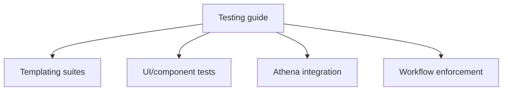

# Testing Guide

<!-- codex:architecture-diagram:start -->
## Architecture Diagram

<!-- codex:architecture-diagram:end -->

Comprehensive testing guidance for the Resource Framework, including templating, adapters, forms, and app-level render paths.

## Test Coverage

The repository currently runs a broad test suite (unit, component, contract, and env-gated integration) with around **300 tests** in regular CI/local runs.

### Templating Tests (Core suites across 6 files)

1. **templating.test.ts** (27 tests)
   - EnvStrategy (3 tests)
   - UserStrategy (3 tests)
   - ResourceStrategy (3 tests)
   - ColumnStrategy (2 tests)
   - Mixed templates (2 tests)
   - Type coercion (5 tests)
   - Edge cases (5 tests)
   - Options (4 tests)

2. **advanced.test.ts** (54 tests)
   - Nested object access (3 tests)
   - Mixed context resolution (2 tests)
   - Type coercion edge cases (5 tests)
   - Special characters (4 tests)
   - Arrays and objects (2 tests)
   - Template edge cases (5 tests)
   - Case sensitivity (3 tests)
   - Custom strategies (2 tests)
   - Performance (2 tests)
   - Real-world scenarios (4 tests)
   - Fallback behavior (3 tests)
   - Error handling (2 tests)
   - Complex templates (3 tests)
   - Resource shortcuts (3 tests)
   - Column validation (3 tests)
   - Whitespace (2 tests)
   - Multiple types (2 tests)
   - Null/undefined (3 tests)
   - Recursive templates (1 test)

3. **integration.test.ts** (31 tests)
   - File explorer widget scenarios (4 tests)
   - Table widget scenarios (2 tests)
   - Drilldown title scenarios (2 tests)
   - URL construction (2 tests)
   - Multi-level navigation (1 test)
   - Batch resolution (1 test)
   - Condition building (1 test)
   - Real configurations (2 tests)
   - Default values (2 tests)
   - Complex paths (2 tests)
   - Condition type preservation (3 tests)
   - Widget configuration (1 test)
   - Prefix precedence (2 tests)
   - Empty/whitespace (3 tests)
   - Backward compatibility (1 test)
   - S3 client config (2 tests)

4. **strategies.test.ts** (26 tests)
   - EnvStrategy unit tests (3 tests)
   - UserStrategy unit tests (5 tests)
   - ResourceStrategy unit tests (4 tests)
   - ResourceIdShorthandStrategy (4 tests)
   - ColumnStrategy unit tests (7 tests)
   - Strategy composition (1 test)
   - Edge cases (3 tests)

5. **registry.test.ts** (16 tests)
   - Registration (3 tests)
   - Retrieval (3 tests)
   - Unregistration (3 tests)
   - Clear registry (2 tests)
   - Initialization (2 tests)
   - Strategy execution (2 tests)
   - Multiple registrations (1 test)

6. **error-scenarios.test.ts** (59 tests)
   - Malformed input (6 tests)
   - Malformed templates (4 tests)
   - Circular references (1 test)
   - Large numbers (3 tests)
   - Special values (6 tests)
   - Unicode and encoding (4 tests)
   - SQL injection prevention (2 tests)
   - Strategy errors (3 tests)
   - Context edge cases (4 tests)
   - Concurrent resolution (1 test)
   - Memory and performance (3 tests)
   - Type coercion edge cases (4 tests)
   - Options edge cases (4 tests)
   - Prefix detection (4 tests)
   - Strategy fallback (1 test)
   - Real error scenarios (4 tests)
   - Path construction errors (2 tests)
   - Logging warnings (2 tests)
   - Security edge cases (2 tests)

## Running Tests

### All Templating Tests
```bash
npx vitest run templating/__tests__/
```

### Specific Test File
```bash
npx vitest run templating/__tests__/templating.test.ts
npx vitest run templating/__tests__/advanced.test.ts
npx vitest run templating/__tests__/integration.test.ts
npx vitest run templating/__tests__/strategies.test.ts
npx vitest run templating/__tests__/registry.test.ts
npx vitest run templating/__tests__/error-scenarios.test.ts
```

### Watch Mode
```bash
npx vitest templating/__tests__/
```

### Coverage
```bash
npx vitest run --coverage templating/__tests__/
```

## Test Categories

### Unit Tests
Test individual strategies and functions in isolation.

**Example:**
```typescript
describe("UserStrategy", () => {
  const strategy = new UserStrategy();

  it("should resolve user properties", () => {
    const context = {
      user: { name: "John" }
    };
    expect(strategy.resolve("name", context)).toBe("John");
  });
});
```

### Integration Tests
Test complete workflows and component interactions.

**Example:**
```typescript
it("should build complete S3 object path", () => {
  const context = {
    user: { organization_id: "org-123" },
    entity: { customer_id: "cust-456" },
    idColumn: "customer_id"
  };

  const path = resolveTemplate(
    "rsf/{{user.organization_id}}/customers/{{resource_id}}",
    context
  );

  expect(path).toBe("rsf/org-123/customers/cust-456");
});
```

### Error Scenarios
Test edge cases, malformed input, and error handling.

**Example:**
```typescript
it("should handle missing data gracefully", () => {
  const result = resolveTemplate("{{missing}}", {});
  expect(result).toBe("");
});
```

## Writing Tests

### Test Structure

```typescript
import { describe, it, expect, beforeEach } from "vitest";
import { resolveTemplate } from "../resolver";
import { initializeTemplating, clearRegistry } from "../index";

describe("Feature Name", () => {
  beforeEach(() => {
    clearRegistry();
    initializeTemplating();
  });

  it("should do something", () => {
    const result = resolveTemplate("{{value}}", {
      entity: { value: "test" }
    });
    expect(result).toBe("test");
  });
});
```

### Best Practices

1. **Clear registry before each test**
```typescript
beforeEach(() => {
  clearRegistry();
  initializeTemplating();
});
```

2. **Test both positive and negative cases**
```typescript
it("should resolve when data exists", () => {
  const result = resolveTemplate("{{value}}", { entity: { value: "test" } });
  expect(result).toBe("test");
});

it("should return empty when data missing", () => {
  const result = resolveTemplate("{{value}}", {});
  expect(result).toBe("");
});
```

3. **Test type preservation**
```typescript
it("should preserve number types", () => {
  const result = resolveTemplateValue("{{count}}", {
    entity: { count: 42 }
  });
  expect(result).toBe(42);
  expect(typeof result).toBe("number");
});
```

4. **Test edge cases**
```typescript
it("should handle null, undefined, empty string", () => {
  expect(resolveTemplateValue("{{v}}", { entity: { v: null } })).toBe(null);
  expect(resolveTemplateValue("{{v}}", { entity: { v: undefined } })).toBe(null);
  expect(resolveTemplateValue("{{v}}", { entity: { v: "" } })).toBe(null);
});
```

## Assertions

### Common Assertions

```typescript
// Equality
expect(result).toBe("expected");
expect(result).toEqual({ key: "value" });

// Type checks
expect(typeof result).toBe("number");
expect(result).toBeInstanceOf(Date);

// Truthiness
expect(result).toBeTruthy();
expect(result).toBeFalsy();
expect(result).toBeDefined();
expect(result).toBeUndefined();
expect(result).toBeNull();

// Arrays
expect(array).toHaveLength(3);
expect(array).toContain("value");

// Errors
expect(() => fn()).toThrow();
expect(() => fn()).toThrow("Error message");

// Numeric comparisons
expect(result).toBeGreaterThan(10);
expect(result).toBeCloseTo(0.3);
```

## Mocking

### Mock Strategy

```typescript
import { registerStrategy } from "../registry";

class MockStrategy implements TemplateStrategy {
  resolve(key: string): unknown {
    return `mock-${key}`;
  }
}

registerStrategy("mock", new MockStrategy());
```

### Mock Context

```typescript
const mockContext: TemplateContext = {
  user: { id: "user-1", organization_id: "org-1" },
  entity: { id: "entity-1", name: "Test" },
  idColumn: "id",
  columns: ["id", "name"],
  resourceName: "test_resource"
};
```

## Test Coverage Goals

- **Statements**: >90%
- **Branches**: >85%
- **Functions**: >90%
- **Lines**: >90%

## Continuous Integration

Tests run automatically on:
- Pull requests
- Commits to main
- Release builds

## See Also

- [Testing](./25-testing.md) - General testing strategies
- [Type Safety](./23-type-safety.md) - TypeScript testing
- [Performance](./24-performance.md) - Performance testing

<!-- codex:architecture-review:start -->
## Architecture Assessment
- Technical debt rating: 3/5 - the guide is valuable, but fixed test counts and manually curated coverage descriptions are brittle.
- Refactor path: Align the guide with generated metrics and stable test categories rather than exact counts.
- Replacement: A generated test matrix in docs plus workflow badges and coverage summaries.
- Weak points: Exact numbers drift, categories can lag behind new suites, and the guide can overstate confidence if CI requirements change.
<!-- codex:architecture-review:end -->
