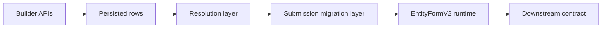

# Form Builder And Renderer

<!-- codex:architecture-diagram:start -->
## Architecture Diagram

<!-- codex:architecture-diagram:end -->

This package now has a clearer split between builder-time and runtime concerns.

## Builder-time API

Use these APIs when defining forms in code or generating seeded rows:

- `defineResourceFormSchema(schema)`
- `defineResourceForm(definition)`
- `createResourceFormRow(definition)`
- `createResourceFormRows(definitions)`

Builder-time responsibilities:

- authoring valid schemas
- setting defaults and metadata
- assigning a stable slug/id
- assigning explicit migration lineage (`schemaVersion`, `migrationKey`)
- carrying source lineage (`source_schema_provider`, `source_schema_url`)

## Runtime API

Use these APIs when reading rows back from `resource_forms`:

- `resolveResourceFormRow(row)`
- `resolveResourceFormRows(rows)`
- `useResourceFormRuntime(forms)`
- `migrateResolvedResourceFormSubmission({ form, toVersion, payload, registry })`
- `EntityFormV2`

Runtime responsibilities:

- validating schema shape before rendering
- normalizing titles/slugs/default values
- normalizing schema version lineage for migration-aware consumers
- applying deterministic `step_order`
- managing selected form state and live values
- rendering field controls and step transitions

## Renderer contract

`EntityFormV2` consumes:

```ts
{
  schema: ResourceFormSchema;
  values: Record<string, unknown>;
  errors?: Record<string, string>;
  onChange: (key: string, value: unknown) => void;
  onSubmit: () => void;
  onStepChange?: (stepIndex: number, stepKey: string) => void;
  isSubmitting?: boolean;
}
```

`EntityFormV2` now delegates step ordering to `getOrderedResourceFormSteps()`, so the order logic is shared across all consumers.

## Recommended architecture

Keep the layers separate:

1. Builder/seed layer: creates definitions and rows.
2. Storage layer: persists rows in `resource_forms`.
3. Runtime adapter layer: fetches rows from Athena or mocks.
4. Resolution layer: validates and normalizes rows.
5. Migration layer: upgrades/downgrades submission payloads by `(migrationKey, schemaVersion)`.
6. Renderer layer: binds resolved schema to form state and UI.

## Anti-patterns

Avoid these patterns:

- duplicating `resolveResourceFormRows()` in each app
- hand-sorting steps in page components
- rendering unvalidated `schema` payloads directly from unknown DB rows
- treating `default_values` as authoritative schema data
- mixing business-specific validation rules into generic authoring helpers unless they are truly cross-form

## Testing guidance

Add tests for:

- malformed field definitions
- step ordering edge cases
- duplicate field keys
- option-bearing field types without options
- definition-to-row round trips
- row-to-runtime resolution
- upgrade/downgrade migration paths for submission payloads
- admin save/seed flows against mocked persistence adapters

See `tests/resource-forms.test.ts` for the current baseline.

<!-- codex:architecture-review:start -->
## Architecture Assessment
- Technical debt rating: 4/5 - the builder/renderer split is clearer now, but it still shares one package and many implicit runtime assumptions.
- Refactor path: Define formal contracts between authoring, resolution, migration, and rendering layers.
- Replacement: A versioned forms platform with separate builder, runtime, and submission packages.
- Weak points: The boundaries are documented better than they are enforced, migrations require manual registry maintenance, and renderer behavior is still coupled to schema conventions.
<!-- codex:architecture-review:end -->
