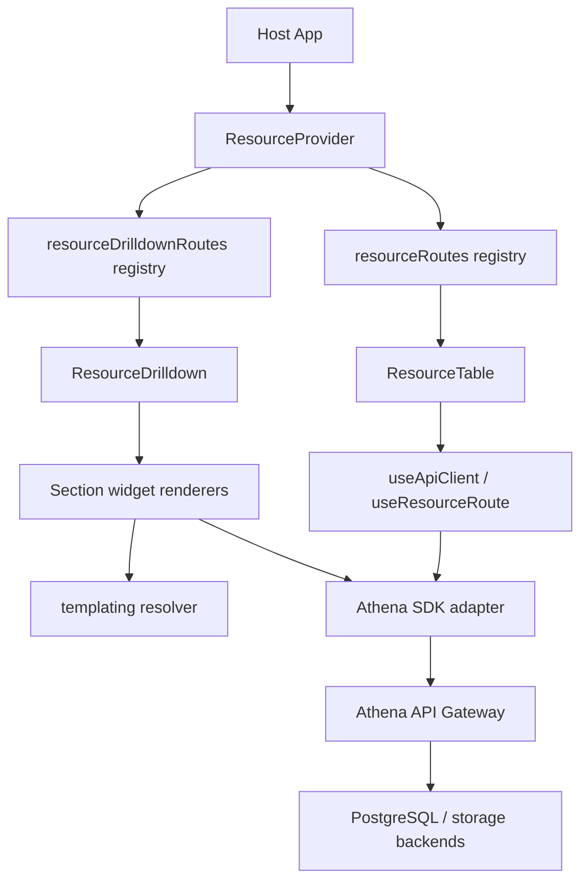

# Complete Technical Reference

## Purpose

This document is the high-fidelity reference for how the framework is wired in production-style setups: routing model, adapter boundaries, data contracts, render pipeline, extension points, and reliability controls.

<!-- codex:architecture-diagram:start -->
## Architecture Diagram

<!-- codex:architecture-diagram:end -->

## Runtime Layers

1. Route declaration layer
- `registries/resource-routes.ts`
- `registries/resource-drilldown-routes.ts`
- canonical metadata for table names, id columns, search/filter behavior, edit constraints

2. Composition layer
- `components/ResourceProvider.tsx`
- `components/ResourceTable.tsx`
- `components/ResourceDrilldown.tsx`
- orchestrates route metadata, data fetching, mutation hooks, render sections

3. Behavior layer
- hooks in `hooks/*`
- constructors in `constructors/*`
- utility policies in `utils/*`

4. Transport layer
- `adapters/athena-gateway.ts`
- `adapters/athena-files.ts`
- request-id and idempotency propagation

5. Cross-cutting systems
- templating (`templating/*`)
- notifications (`notifications/*`)
- lightbox preview (`lightbox/*`)

## Data Contract Baseline

### Resource route minimum

```ts
{
  table: string,
  idColumn: string
}
```

### Strongly recommended route fields

- `columns`: explicit column metadata and ordering
- `edit`: allowed/denied columns and mutation constraints
- `companyIdColumn`: tenancy guardrails
- `enableSearch`, `searchBy`
- `drilldownHref` or `drilldownPathTemplate`

### Drilldown route minimum

- `title` resolver
- sections containing widget specs
- widgets reference typed `spec.type` and `spec.props`

## Request Flow Details

### Table load

1. `ResourceTable` resolves active `ResourceRoute`
2. `useApiClient` builds Athena client with identity headers
3. adapter calls fetch path (`select` semantics)
4. response normalized to framework row shape
5. render with column registry + table controls

### Record update

1. edit-state computes changed fields
2. `useApiClient.update` sends mutation with idempotency key
3. optional immediate verification refetch
4. UI state commits success/failure notification

### File upload widget

1. widget resolves templated path/ids
2. `uploadFileViaAthena` posts `FormData`
3. metadata inserted via same `useApiClient` row write
4. file row appears in widget listing

## Extension Surface

### Add a new table widget

1. create renderer component in `components/sections/widgets/*`
2. declare prop type in `resource-types.ts`
3. register via `registerSectionWidget(type, renderer)`
4. add docs + tests for edge conditions

### Add a new templating strategy

1. implement strategy contract under `templating/strategies/*`
2. register in templating registry
3. test `resolveTemplate` and `resolveTemplateValue`
4. document allowed keys and trust boundaries

### Add a new column renderer

1. implement registry renderer in `constructors/column-registry.tsx`
2. include sorting/filtering metadata
3. reference from route `columns[].use`

## Reliability Controls

### Must-have controls

- request tracing (`X-Request-Id`)
- idempotency keys on write operations
- bounded retry behavior (adapter-level)
- deterministic schema validation for `resource_forms`

### Failure classes to watch

- stale reads after writes
- mutation succeeds but UI refresh fails
- file object write succeeds while metadata insert fails
- template resolution with missing context values

## Packaging and API Stability

### Public API

- root export: `@xylex-group/resource-framework`
- subpaths: `./components`, `./adapters`

### Rules

- avoid deep imports outside declared exports
- keep domain types in dedicated modules and re-export through stable entry points
- treat demo app aliases as non-package implementation details

## Testing Strategy

1. Contract tests
- adapter behavior normalization
- request header propagation
- deterministic form schema validation

2. Component tests
- renderer state transitions
- form step validation and navigation
- admin flows with mocked adapters

3. Integration tests (env-gated)
- real Athena CRUD path
- real upload/refresh path where endpoints exist

## CI Expectations

- root lint/typecheck/test/build green
- demo lint/build green
- playground typecheck/build green
- dedicated resource-forms workflow and actionlint workflow green

## Release Checklist

1. `npm run lint:all`
2. `npm run typecheck`
3. `npm test`
4. `npm run build`
5. `npm pack --dry-run --ignore-scripts`
6. verify exported surface and changelog

## Operational Notes

- when running installs in restricted runners, use local npm cache path
- treat circular warnings from transitive libs as warnings unless behavior regresses
- prioritize breaking export changes only in explicit release boundaries

<!-- codex:architecture-review:start -->
## Architecture Assessment
- Technical debt rating: 3/5 - architecture is coherent, but host/demo alias bleed-through still creates occasional packaging friction.
- Refactor path: enforce strict internal import rules and package-boundary lint checks.
- Replacement: a generated API manifest plus boundary tests for every exported symbol.
- Weak points: monorepo alias drift, transitive dependency noise, and mixed app/package concerns during builds.
<!-- codex:architecture-review:end -->
