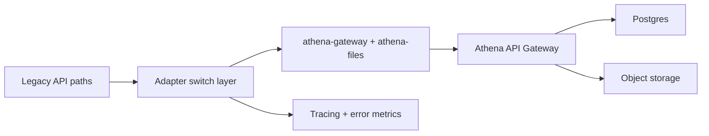

# Athena Migration Runbook

## Scope

Runbook for migrating all data and file operations to Athena API Gateway with controlled rollout and rollback readiness.

<!-- codex:architecture-diagram:start -->
## Architecture Diagram

<!-- codex:architecture-diagram:end -->

## Preconditions

- Athena SDK pinned and installed
- tenant identity fields available (`user_id`, `company_id`, `organization_id`)
- idempotency and request-id headers enforced in adapters
- environment-gated integration test variables available for target env

## Migration Phases

### Phase 0: Baseline inventory

- enumerate all CRUD call sites
- enumerate all file upload/refresh call sites
- tag each by route/widget/hook owner

### Phase 1: Read path migration

- move fetch/select operations to Athena adapter
- preserve response shape compatibility
- add telemetry tags per route/table

Exit criteria:
- no legacy fetch path usage in framework source
- read latency and error budgets unchanged or improved

### Phase 2: Write path migration

- move insert/update/delete to Athena adapter
- enforce idempotency key on each mutation
- validate post-write consistency for critical flows

Exit criteria:
- no client-side embedded secret paths
- mutation success/error semantics unchanged for UI callers

### Phase 3: File path migration

- move upload and refresh endpoints to Athena-backed adapter
- ensure metadata write and storage write sequencing is observable
- add reconciliation diagnostics hooks

Exit criteria:
- file widget uses only Athena file adapter
- refresh failures provide user-facing and telemetry visibility

### Phase 4: Deprecation cleanup

- remove legacy adapters from exports
- remove obsolete docs and examples
- enforce lint rules for banned imports

Exit criteria:
- zero references to removed adapters
- package exports reflect only supported surfaces

## Cutover Playbook

1. enable migration in staging
2. run contract tests and integration tests
3. exercise top user journeys manually
4. deploy behind progressive traffic gate
5. monitor for at least one full business cycle
6. complete full cutover and remove fallback paths

## Rollback Playbook

1. flip adapter feature flag to previous transport
2. preserve write audit trail and request IDs
3. capture failed request samples
4. patch and re-run staged validation before re-cutover

## Observability Checklist

- request success/error rate by operation
- p95/p99 latency by route
- mutation idempotency collision counts
- upload success vs metadata insert success split
- signed URL refresh failure ratio

## Known Risk Areas

- cross-tenant header propagation mistakes
- endpoint mismatch between environments
- object-write and metadata-write partial failure scenarios
- stale cache reads after successful writes

## Verification Matrix

- unit: adapter normalization and header injection
- contract: write/read shape guarantees
- integration: real env CRUD and file flows
- smoke: demo and playground critical pages

<!-- codex:architecture-review:start -->
## Architecture Assessment
- Technical debt rating: 3/5 - migration surface is mostly complete but still sensitive to environment divergence.
- Refactor path: centralize endpoint capability discovery and enforce runtime checks before feature usage.
- Replacement: environment capability registry consumed by adapters.
- Weak points: file endpoint availability mismatch and tenant-context drift.
<!-- codex:architecture-review:end -->
