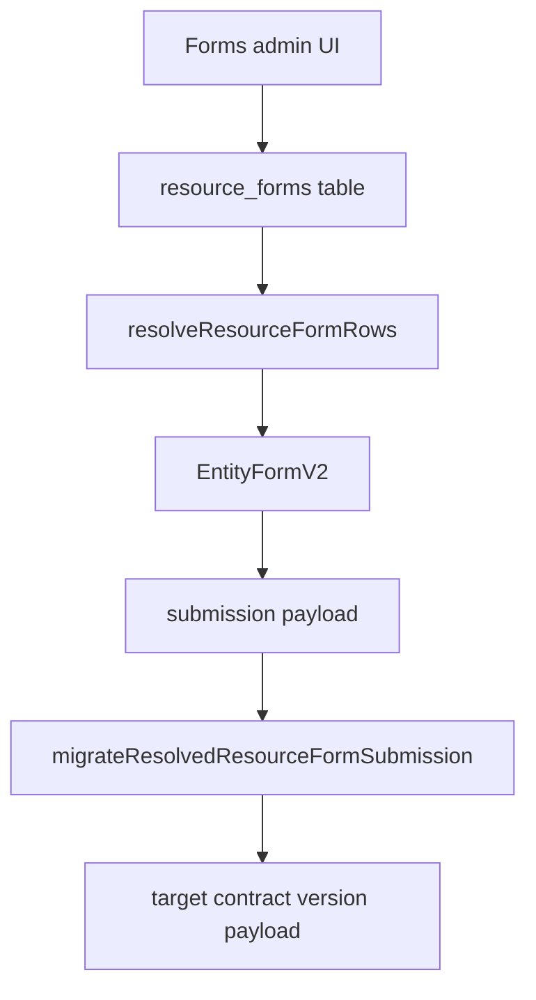

# Resource Forms Operations Guide

## Scope

Operational guide for `resource_forms` lifecycle: authoring, validation, versioning, migration execution, rollout safety, and incident response.

<!-- codex:architecture-diagram:start -->
## Architecture Diagram

<!-- codex:architecture-diagram:end -->

## Canonical Row Shape

Required keys:
- `resource_form_id`
- `slug`
- `entity`
- `schema`

Version lineage keys:
- `schema_version`
- `migration_key`

Operational keys:
- `default_values`
- `is_active`
- `sort_order`
- `source_schema_provider`
- `source_schema_url`

## Authoring Workflow

1. define schema with `defineResourceFormSchema`
2. define form metadata with `defineResourceForm`
3. materialize rows via `createResourceFormRow(s)`
4. validate with `validateResourceFormSchema`
5. publish row and confirm resolver output

## Validation Rules

- entity must be non-empty
- each step must contain at least one field
- each field must declare valid `type`, `key`, and `label`
- select-like field types must provide options
- step order entries must reference existing steps
- duplicate field keys inside a step are rejected

## Versioning Model

### Invariants

- version numbers are positive integers
- `migration_key` groups compatible evolutionary lineage
- migrations are explicit step edges between adjacent versions

### Safe rollout pattern

1. publish new schema as `version + 1` inactive
2. add migration edges from old to new and reverse if needed
3. run migration preview on sample payloads
4. activate new row, monitor submit outcomes
5. retire old row only after stable window

## Submission Migration Operations

### Upgrade flow

- user submits against current schema version
- runtime selects target contract version
- migration planner computes path
- executor applies each transform deterministically

### Downgrade flow

- only allowed if reverse edges are registered
- missing reverse edge is treated as hard failure

## Admin UI Operating Procedure

1. inspect current rows and lineage
2. clone existing row for new version
3. edit schema and defaults
4. validate in UI and in test suite
5. save and verify render in playground/demo

## Test Requirements

- schema validation edge cases
- migration planner path tests
- migration executor upgrade and downgrade tests
- renderer submit payload snapshot (raw and migrated)
- admin save/seed flows with mocked adapter

## Incident Playbook

### Invalid schema published

1. deactivate broken row (`is_active=false`)
2. reactivate last known good row
3. patch schema and add regression test

### Migration path missing

1. block rollout to target version
2. add explicit migration edge(s)
3. rerun migration tests and preview data samples

### Submission mismatch

1. capture raw + migrated payload and lineage metadata
2. identify failing transform edge
3. patch transform and backfill if needed

## Governance

- enforce one owning team per migration key
- require PR review for schema and migration changes
- track compatibility policy per key (backward-only, bidirectional, etc.)

<!-- codex:architecture-review:start -->
## Architecture Assessment
- Technical debt rating: 2/5 - form tooling is strong, with remaining risk mostly in operational discipline.
- Refactor path: add migration policy metadata and automated compatibility checks in CI.
- Replacement: policy-driven migration framework with mandatory lineage constraints.
- Weak points: human error in migration edge registration and rollout sequencing.
<!-- codex:architecture-review:end -->
