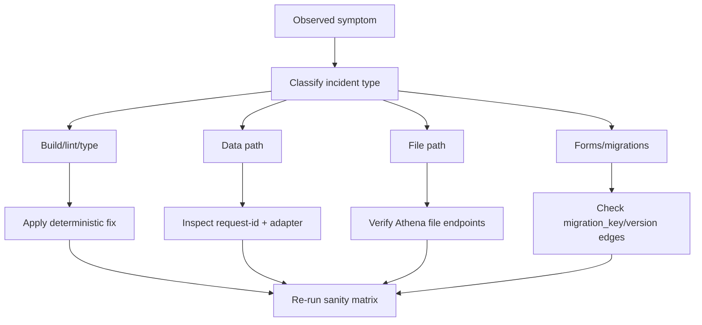

# Troubleshooting Playbook

## Scope

Practical diagnostics for build, type, lint, runtime data, file upload, templating, and forms migration incidents.

<!-- codex:architecture-diagram:start -->
## Architecture Diagram

<!-- codex:architecture-diagram:end -->

## Sanity Matrix

Run in this order:

1. `npm run lint:all`
2. `npm run typecheck`
3. `npm test`
4. `npm run build`
5. `cd apps/demo && npm run build`
6. `cd apps/playground-next && npm run build`

## Build/Type Failures

### Alias resolution failures

Symptoms:
- `TS2307 Cannot find module ...`

Checks:
- confirm import path is package-safe for build context
- avoid app-local aliases inside package-emitted types

Fix pattern:
- replace self-import alias with relative package import
- keep host-only aliases inside host app code only

### Declaration surface loops

Symptoms:
- dist `.d.ts` imports package root from internal module

Checks:
- inspect `dist/**/*.d.ts` for `@/packages/resource-framework`

Fix pattern:
- import internal types from local module path, not root export

## Lint Failures

### Flat config migration issues

Symptoms:
- `.eslintignore no longer supported`
- unknown CLI flags from legacy config style

Fix pattern:
- move ignores into `eslint.config.mjs`
- remove `.eslintignore`
- run lint with flat-config-compatible scripts

### Unused disable directives

Symptoms:
- warnings for unused `eslint-disable` comments

Fix pattern:
- remove stale directives
- keep only directives that suppress active rules

## Data Path Incidents

### Write success reported, stale UI remains

Checks:
- verify post-mutation refresh call path
- inspect adapter response normalization
- compare updated fields vs refetched fields

Fix pattern:
- keep best-effort refresh non-fatal
- add targeted refetch where consistency is required

### Unauthorized/forbidden errors

Checks:
- confirm tenant context headers
- verify API key source and environment wiring

Fix pattern:
- ensure adapter config precedence is deterministic
- verify `X-User-Id`, `X-Company-Id`, `X-Organization-Id`

## File Path Incidents

### Upload endpoint not found

Checks:
- confirm `NEXT_PUBLIC_ATHENA_STORAGE_S3_ID` points to an accessible managed storage catalog
- validate gateway base URL and route support

Fix pattern:
- use capability-aware endpoint mapping
- skip file tests in envs without file routes

### Upload succeeded, file not visible

Checks:
- inspect metadata insert step after object upload
- confirm resource and organization columns used by widget

Fix pattern:
- make insert retryable with idempotency key
- add reconciliation telemetry

## Resource Forms Incidents

### Form not rendering

Checks:
- validate schema with `validateResourceFormSchema`
- confirm row is active and entity is expected

Fix pattern:
- fix schema issues and republish
- ensure step order references valid steps

### Migration failure

Checks:
- verify migration key and both versions
- confirm registry contains full path edges

Fix pattern:
- add missing edge(s)
- rerun migration tests with representative payloads

## CI Playbook

1. identify first failing job, not downstream jobs
2. reproduce locally with exact script
3. fix root cause and rerun full sanity matrix
4. ensure no hidden warnings that indicate future breakage

## High-Value Preventive Checks

- static check for banned internal alias patterns in package source
- check emitted declarations for self-referential root imports
- gate merges on `lint:all`, typecheck, tests, and package build

<!-- codex:architecture-review:start -->
## Architecture Assessment
- Technical debt rating: 3/5 - failure handling is decent but relies on manual triage discipline.
- Refactor path: codify these checks into automated CI guards and prepack verification scripts.
- Replacement: a machine-enforced quality gate pipeline with targeted smoke suites.
- Weak points: environment-specific endpoint drift and alias leakage into emitted types.
<!-- codex:architecture-review:end -->
