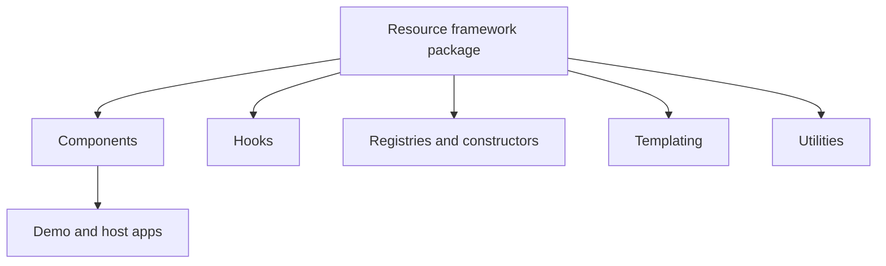

## Resource Framework Overview

<!-- codex:architecture-diagram:start -->
## Architecture Diagram

<!-- codex:architecture-diagram:end -->

The `packages/resource-framework` package provides the UI primitives, data helpers, and configuration tools that drive the dashboard drilldowns, widgets, and table views across the Suitsbooks project. It is organized into the following layers:

1. **Components** – shared React components (tables, drilldowns, widgets, edit state helpers) that can be composed inside resource pages and drilldowns.
2. **Hooks** – reusable hooks such as `useResourceRoute`, `useTableConfiguration`, and `useApiClient` that coordinate API work, selection, and UI state.
3. **Registries & Constructors** – resource route definitions, widget registries, and helpers like `defineColumns` that turn structured data into Cupertino-consistent grids.
4. **Templating** – the new strategy-based `templating` system that resolves `{{…}}` tokens, powers conditional widget props, and allows extensions like `{{env.XXX}}` or `{{resource_id}}`. It exports `resolveTemplate`/`resolveTemplateValue` plus the `TemplateContext`/`TemplateStrategy` building blocks.
5. **Utilities** – key-case helpers, formatting, CSV exports, and drilldown-specific helpers that the UI layers consume.

### Usage Snapshot

- **Tables & Widgets** use `resource-types` for strongly-typed widget specs.
- **Drilldowns** render sections via `components/sections`, each reaching into `templating` when they support `{{ }}` tokens.
- **Hooks** such as `useResourceRoute` rely on the generator helpers in `constructors/` and the registries under `registries/`.

### Directory Structure

```
packages/resource-framework/
├── components/
├── hooks/
├── registries/
├── constructors/
├── handlers/
├── utils/
├── templating/
│   ├── strategies/
│   └── __tests__/
├── resource-types.ts
└── docs/
    └── overview.md  ← this file
```

Add more markdown files in `docs/` as the framework evolves (API contracts, widget guides, template strategy extensions, etc.).

<!-- codex:architecture-review:start -->
## Architecture Assessment
- Technical debt rating: 2/5 - the overview is structurally fine, but it should stay aligned with the actual published package boundary.
- Refactor path: Keep the overview generated from package exports and module manifests where possible.
- Replacement: A generated architecture summary page sourced from the codebase.
- Weak points: High-level summaries can hide deep aliasing or packaging issues if they are not updated alongside code movement.
<!-- codex:architecture-review:end -->
